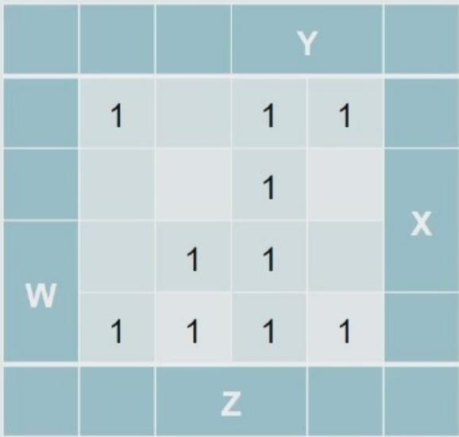
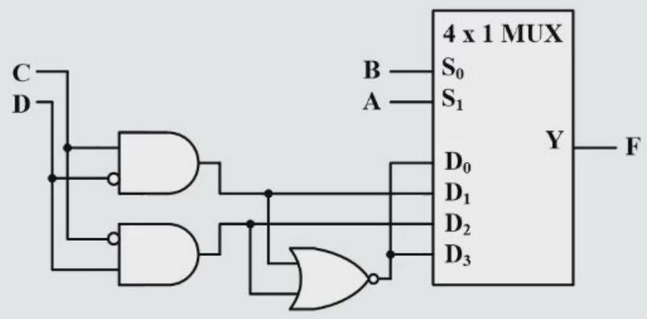
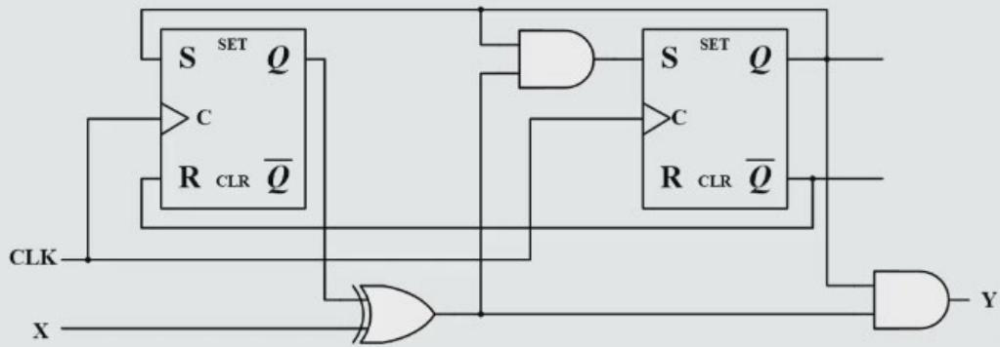
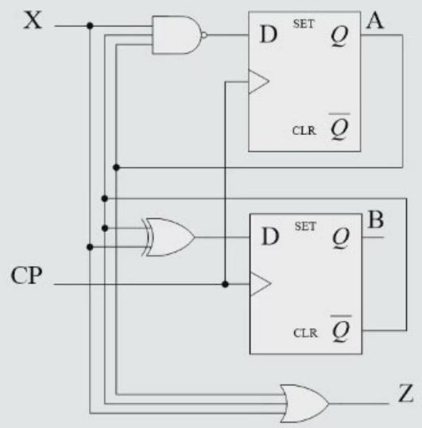
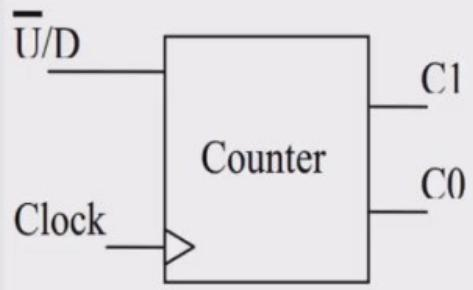
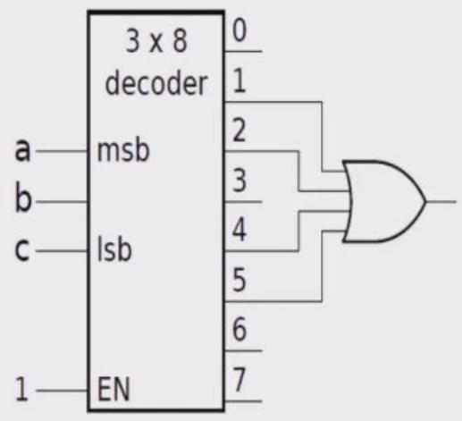
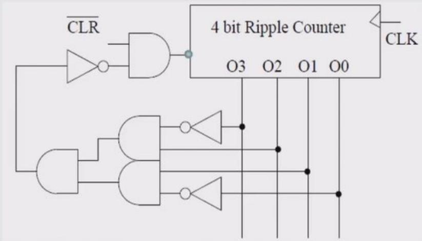

# CS1028 Computer Systems (系统一) — Exercise & Quiz Collection

> Consolidated from lecture quizzes, homework exercises, and exam preparation materials.
> All questions translated to English. MIPS references converted to RISC-V; multicycle design converted to single-cycle.
> Duplicate questions merged. Original sources: quiz1.pptx, quiz2.pptx, quiz3.pptx, and homework exercise photos.

---

## Chapter 1 — Computer Performance (§1.6)

### 1.1 CISC vs RISC Performance Comparison (8 pts)

In this exercise, you will evaluate the performance difference between two CPU architectures, CISC (Complex Instruction Set Computing) and RISC (Reduced Instruction Set Computing). Generally speaking, CISC CPUs have more complex instructions than RISC CPUs and therefore need fewer instructions to perform the same tasks. However, typically one CISC instruction, since it is more complex, takes more time to complete than a RISC instruction. Assume that a certain task needs P CISC instructions and 2P RISC instructions, and that one CISC instruction takes 8T ns to complete, and one RISC instruction takes 2T ns. Under this assumption, which one has the better performance?

*Reference: §1.6*

### 1.2 Software Optimization — Arithmetic (8 pts)

Sometimes software optimization can dramatically improve the performance of a computer system. Assume that a CPU can perform a multiplication operation in 10 ns, and a subtraction operation in 1 ns. How long will it take for the CPU to calculate the result of $d = a \times b - a \times c$ ? Could you optimize the equation so that it will take less time?

*Reference: §1.6*

### 1.3 Processor Performance: Clock Rate & CPI

Consider three different processors P1, P2, P3 executing the same instruction set with the clock rates and CPIs given in the following table:

| Processor | Clock Rate | CPI |
|-----------|-----------|-----|
| P1 | 2 GHz | 1.5 |
| P2 | 1.5 GHz | 1.0 |
| P3 | 3 GHz | 2.5 |

(1) Which processor has the highest performance?

(2) If the processors each execute a program in 10 seconds, find the number of cycles and the number of instructions.

### 1.4 CPI Optimization with Instruction Mix (Multiple Choice) ★

A single-cycle CPU supports four instruction types: A, B, C, and D. In a typical program:

| Type | Frequency | CPI |
|------|-----------|-----|
| A | 10% | 1 |
| B | 20% | 4 |
| C | 30% | 3 |
| D | 40% | ? |

After an optimization, the CPI of type D is **halved** and the overall CPI becomes **3**. What was the original CPI of instruction type D?

### 1.5 Single-Cycle CPU: Clock Rate & Execution Time (10 pts) ★

A single-cycle CPU has the following instruction timing:

| Instruction Type | Time |
|---|---|
| R-type | 750 ps |
| Load (ld) | 1000 ps |
| B-type (branch) | 875 ps |
| I-type | 625 ps |
| J-type (jump) | 600 ps |

**(1)** What is the maximum clock rate of this CPU?

**(2)** Compute the CPI.

**(3)** Given an instruction count (IC) of 10⁸, compute the total CPU execution time.

**(4)** After an optimization, the execution time from (3) is reduced to **80%**, but each instruction requires **1.2×** as many clock cycles. What is the new clock rate?

---

## Chapter 2 — Data Representation

### 2.1 Interpreting Bit Patterns (15%)

The bits have no inherent meaning. Given the pattern:

**0xAD100002**

What does it represent, assuming that it is:

1. a two's complement integer?
2. an unsigned integer?
3. a biased notation (移码 / excess notation)?
4. a single-precision floating-point number?

### 2.2 IEEE 754 Floating-Point Representation (20%)

**(a) (5%)** Show the IEEE 754 binary representation for the floating-point number **−23.3125₁₀** in single precision.

**(b) (15%)** Put the corresponding letters for each 32-bit value in order from least to greatest.

*(Hint: the question isn't asking you to write down what each one is, it only asks for the relative order!)*

| Label | Value | Interpretation |
|-------|-------|----------------|
| A | 0xF0000000 | sign-magnitude |
| B | 0xF0000000 | 2's complement |
| C | 0xF0000000 | biased notation (移码) |
| D | 0xF0000000 | IEEE 754 float |
| E | 0xF0000000 | 1's complement |
| F | 0xF7000000 | sign-magnitude |
| G | 0xF7000000 | 2's complement |
| H | 0xF7000000 | biased notation (移码) |
| I | 0xF7000000 | IEEE 754 float |

```
Least ← [  ][  ][  ][  ][  ][  ][  ][  ][  ] → Greatest
```

### 2.3 Booth's Algorithm (10%)

Use Booth's algorithm (1 or 2 bits) to multiply **13 by (−21)**.

### 2.4 BCD Code Conversion (Multiple Choice) ★

The BCD (Binary-Coded Decimal) representation of the decimal number **34** is:

- A. `0010 0010`
- B. `0011 0100`
- C. `0100 0011`
- D. `0100 0100`

### 2.5 Two's Complement Conversion (Multiple Choice) ★

The 8-bit two's complement representation of **(−35)₁₀** is ____.

### 2.6 IEEE 754 Floating-Point: −17.5625₁₀ (Multiple Choice) ★

Show the IEEE 754 single-precision binary representation of the floating-point number **−17.5625₁₀**.

### 2.7 Signed Overflow Conditions (Multiple Choice) ★

In which situation can an overflow occur in two's complement arithmetic?

- A. When adding a positive number to a negative number.
- B. When subtracting a positive number from a positive number.
- C. \(c_n = 1\) (carry into the most significant bit is 1)
- D. \(c_n \oplus c_{n-1} = 1\) (carry into MSB XOR carry out of MSB equals 1)

### 2.8 Multiplier Result Bit Width (Multiple Choice) ★

What is the number of bits in the result of multiplying a **5-bit** number by a **5-bit** number?

- A. 5
- B. 10
- C. 25
- D. It depends on the values.

---

## Chapter 3 — RISC-V Assembly & Machine Code (§2)

### 3.1 Binary to Assembly Instruction (2.12) [5 pts] <§§2.2, 2.5>

Provide the instruction type and assembly language instruction for the following binary value:

`0000 0000 0001 0000 1000 0000 1011 0011`₂

### 3.2 C Function to RISC-V Assembly (2.31) [20 pts] <§2.8>

Translate function `f` into RISC-V assembly language. Assume the function declaration for `g` is `int g(int a, int b)`. The code for function `f` is as follows:

```c
int f(int a, int b, int c, int d){
    return g(g(a,b), c+d);
}
```

### 3.3 Pseudoinstruction to RISC-V Conversion (4×5% = 20%)

Convert each pseudoinstruction (left) into the **shortest** sequence of RISC-V instructions.

| Pseudoinstruction | Function |
|---|---|
| `li rd, BIG` | `rd = BIG` — BIG is a 32-bit integer constant in 2's complement format |
| `sne rd, rs1, rs2` | `rd = (rs1 != rs2) ? 1 : 0` |

### 3.4 RISC-V Machine Code Encoding (Question 16)

Give **hexadecimal encodings** (machine language) for the following RISC-V instructions. Assume the start address of memory is **0x0040 0000**.

```
        ld    x12, 8(x10)
loop:   bne   x12, x13, label
        slli  x13, x12, 4
        jal   x0, loop
label:  jalr  x0, 0(x1)
```

### 3.5 Float Addition in RISC-V Assembly (Question 9)

Suppose `float s1 > s0 > 0`; register `t3 = 0xFF000000`, register `t4 = 0x00800000`. Write the RISC-V assembly code to compute:

$$ s2 = s1 + s0 $$

Note: You are not allowed to use the `fadd.s` instruction. You can only use RV32I/RV64I instructions.

### 3.6 Big-Endian vs Little-Endian Memory (2.35) [5 pts] <§2.3, 2.9>

Consider the following code:

```
lb x6, 0(x7)
sd x6, 8(x7)
```

Assume that register `x7` contains the address `0x10000000` and the data at that address is `0x1122334455667788`.

**(a) 2.35.1 [5]** What value is stored in `0x10000008` on a big-endian machine?

**(b) 2.35.2 [5]** What value is stored in `0x10000008` on a little-endian machine?

### 3.7 Key Principles of Computer Design (Multiple Choice)

Today's computers are built on 2 key principles: ( ____ )

① Instructions are represented as numbers.
② Programs can be stored in memory to be read or written just like numbers.
③ Make the common case fast.
④ Every instruction can be conditionally executed.

- A: ①③
- B: ②④
- C: ①②
- D: ③④

### 3.8 True or False

1. "Good design demands no compromise."
2. A callee-saved register is a register saved by the routine making a procedure call.

### 3.9 JALR Instruction Type (Multiple Choice) ★

The RISC-V `JALR` instruction belongs to which instruction format type?

- A. R-type
- B. I-type
- C. S-type
- D. U-type

### 3.10 Base Addressing with Offset (Multiple Choice) ★

Given the following memory contents:

| Memory Address | Stored Data |
|---|---|
| 0x1000 | 0x1008 |
| 0x1004 | 0x100C |
| 0x1008 | 0x1004 |
| 0x100C | 0x100D |

Initially, register `R2` contains `0x0004`. After executing `lw R1, 0x1004(R2)`, what value is stored in register `R1`?

---

## Chapter 4 — Addressing Modes & Instruction Formats

### 4.1 Addressing Modes — Effective Address Calculation (10 pts)

The table below lists 9 addressing modes of a processor and their descriptions. For each, write the formula for calculating the **effective address E**.

| # | Addressing Mode | Description |
|---|---|---|
| (1) | Immediate | The operand is in the instruction itself. |
| (2) | Register | The operand is in a register; the instruction gives the register number. |
| (3) | Direct | Disp is the displacement/offset. |
| (4) | Base | B is the base register. |
| (5) | Base + Displacement | |
| (6) | Scaled Index + Displacement | I is the index register, S is the scale factor. |
| (7) | Base + Index + Displacement | |
| (8) | Base + Scaled Index + Displacement | |
| (9) | PC-Relative | PC is the program counter. |

### 4.2 Instruction Format Design (10 pts)

A processor has the following instruction format:

```
 2 bits   6 bits   3 bits   3 bits
┌───────┬────────┬────────┬────────┐
│   X   │   OP   │ src reg │ dst reg │   Address   │
└───────┴────────┴────────┴────────┴──────────────┘
```

The format indicates there are **8 general-purpose registers** (length 16 bits each). **X** specifies the addressing mode. The actual main memory capacity is **256K words**.

**(1)** Assuming direct access to every main memory unit **without** using a general-purpose register, and the opcode field OP = 6 bits, answer:
- How many bits should the **address code field** be allocated?
- How many bits should the **instruction word length** be?

**(2)** Assuming when **X = 11**, the designated general-purpose register is used as a **base register**, propose a **hardware design plan** such that the designated general-purpose register can access every unit in a **1M** main memory space.

### 4.3 Addressing Mode Identification (Multiple Choice)

The address is the sum of the PC and a constant in the instruction.

- A: Register addressing
- B: Immediate addressing
- C: PC-relative addressing
- D: Base or displacement addressing

### 4.4 Instruction Format Design: 32-bit Uniform ISA (25 pts) ★

A 32-bit instruction set architecture has **130 distinct instructions** and **64 general-purpose registers**. All instructions share the **same format**: each contains an opcode, one destination register field (rd), and one immediate field (imm). Each instruction fits in one word (4 bytes = 32 bits).

**(1)** How many bits are required for the **opcode**?

**(2)** How many bits are required for the **rd** (destination register) field?

**(3)** How many bits remain for the **immediate** field?

**(4)** Assuming the immediate is used as an **unsigned** offset to address memory, what is the maximum memory offset (in words) that can be accessed?

**(5)** Assuming the immediate is a **signed** two's complement value, what is the range of representable values (minimum and maximum)?

---

## Chapter 5 — Single-Cycle CPU Datapath (§4)

### 5.1 C to RISC-V Assembly & Datapath Design (15%)

Convert the C function below to **RISC-V assembly language**. Make sure your assembly code can be called from a standard C program.

```c
void main(int *z, int x, int y)
{
    *z = sub(x, y);
}

int sub(int n, int m)
{
    return m - n;
}
```

#### Datapath Sub-questions

**(1)** In a single-cycle design, can IM (Instruction Memory) and DM (Data Memory) be combined into a single MEM unit? If yes, draw the data path for `lw` and `sw` instructions. If no, explain why.

**(2)** Given a single-cycle CPU with the following delays:
- IM/DM read access time: **2 ns**
- IM/DM write access time: **1.5 ns**
- Controller delay (RegDst, etc.): **4.6 ns**
- ALU delay: **1.7 ns**
- Register file access delay: **1.3 ns**

The instruction types and the functional units they use are:

| Instruction Type | Step 1 | Step 2 | Step 3 | Step 4 | Step 5 |
|---|---|---|---|---|---|
| R-format | Fetch | Reg Read | ALU | Reg Write | |
| lw | Fetch | Reg Read | ALU | Mem Read | Reg Write |
| sw | Fetch | Reg Read | ALU | Mem Write | |
| Branch | Fetch | Reg Read | ALU | | |
| Jump | Fetch | | | | |

Determine the **optimal clock cycle**.

**(3)** Write the general method for computing the clock cycle in a single-cycle datapath. Given that IM, the +4 adder, the controller, the register file, the ALU, and DM each have delays denoted \(T_{IM}\), \(T_{\text{+4 adder}}\), \(T_{\text{controller}}\), \(T_{\text{regfile}}\), \(T_{ALU}\), and \(T_{DM}\). Ignore the delay of switches, sign-extension, left-shift logic, gates, and the controller not already accounted for.

**(4)** An addressing mode called "indexed addressing" is particularly effective for array operations. For the instruction `add x3, (x1 + x2)`, which means `x3 = x3 + MEM(x1 + x2)`, the instruction is in R-type format. Can this instruction be completed in a **single clock cycle** (additional hardware may be added)? If yes, draw the datapath for this instruction in a single-cycle implementation. If no, explain why.

> **Image missing** — datapath diagram referenced in the original slides.

### 5.2 Adding `Addm` Register-Memory Instruction to Single-Cycle Datapath (15%)

Suppose we want to add a **register-memory** instruction to the single-cycle datapath:

```
Addm   rd, rs, rt      # rd = rs + Mem[rt]
```

#### (a) (3%) Machine Code in Binary

Fill in the instruction format below for `Addm`. Bit positions are numbereds.

```
 1  0  9  8  7  6  5  4  3  2  1  0  9  8  7  6  5  4  3  2  1  0  9  8  7  6  5  4  3  2  1  0
┌──────────────────────┬──────────────────────────────────────────────────────────────────────────┐
│              │                                                                          │
├──┬──┬──┬──┬──┬──┬──┬──┼──┬──┬──┬──┬──┬──┬──┬──┼──┬──┬──┬──┬──┬──┬──┬──┼──┬──┬──┬──┬──┬──┬──┬──┤
│ 7│ 6│ 5│ 4│ 3│ 2│ 1│ 0│ 7│ 6│ 5│ 4│ 3│ 2│ 1│ 0│ 7│ 6│ 5│ 4│ 3│ 2│ 1│ 0│ 7│ 6│ 5│ 4│ 3│ 2│ 1│ 0│
└──┴──┴──┴──┴──┴──┴──┴──┴──┴──┴──┴──┴──┴──┴──┴──┴──┴──┴──┴──┴──┴──┴──┴──┴──┴──┴──┴──┴──┴──┴──┴──┘
```

#### (b) (4%) Datapath Changes

Show what changes are needed to support `Addm` in the single-cycle datapath. Draw the datapath for this instruction, and explain any new control signals.

#### (c) (8%) Control Signals

List all control signals needed for `Addm` and their values during the execution of this instruction.

> **Image missing** — Original single-cycle datapath diagram and control signal table.

### 5.3 Store Sum `ss` Instruction Extension (4.13) [25 pts] <§4.4>

Examine the difficulty of adding a proposed `ss rs1, rs2, imm` (Store Sum) instruction to RISC-V.

**Interpretation:** `Mem[Reg[rs1]] = Reg[rs2] + immediate`

**(a) 4.13.1 [10]** Which new functional blocks (if any) do we need for this instruction?

**(b) 4.13.2 [10]** Which existing functional blocks (if any) require modification?

**(c) 4.13.3 [5]** What new data paths do we need (if any) to support this instruction?

**(d) 4.13.4 [5]** What new signals do we need (if any) from the control unit to support this instruction?

**(e) 4.13.5 [5]** Modify Figure 4.21 to demonstrate an implementation of this new instruction.

### 5.4 Multi-Cycle vs Single-Cycle CPU Components (Multiple Choice) ★

Which of the following is a component that exists in a **multi-cycle** CPU datapath but is **not necessary** in a single-cycle CPU?

- A. IR (Instruction Register)
- B. PC (Program Counter)
- C. Instruction Memory
- D. MUX (Multiplexer)

### 5.5 Datapath Design: `lw`, `sw`, `add` Instructions (20 pts) ★

A processor has separate instruction memory and data memory. Three instructions are defined (word = 4 bytes):

| Instruction | Semantics |
|---|---|
| `lw ri, imm` | `Reg[ri] = Mem[imm]`, `PC = PC + 4` |
| `sw ri, imm` | `Mem[imm] = Reg[ri]`, `PC = PC + 4` |
| `add ri, imm` | `Reg[ri] = Reg[ri] + imm`, `PC = PC + 4` |

Given block diagrams of the PC, register file, adder, immediate generator, instruction memory, and data memory:

**(1)** Complete the register file and data memory interface ports.

**(2)** Draw the complete datapath connecting all components. You may add additional components (MUXes, sign-extenders, etc.) as needed.

**(3)** Design the control signals and give their values for each of the three instructions (`lw`, `sw`, `add`).

---

## Chapter 6 — Combinational Logic

### 6.1 Boolean Expression Simplification & Gate Input Cost (6 pts)

Simplify the following with formulas and calculate the gate input cost for the original F and the simplified result.

$$
\mathrm{F} = \mathrm{D} \overline{\mathrm{C}} + \mathrm{C} + \mathrm{ABC} + \mathrm{AB} \overline{\mathrm{C}} + \mathrm{B} \overline{\mathrm{C}} + \mathrm{CD}
$$

*Time: 18 min*

### 6.2 K-Map Optimization: SOP, POS, Essential Prime Implicants (14 pts)

For the following function, answer the questions:

$$
F (A, B, C, D) = \sum m (0, 1, 2, 3, 6, 8) + \sum d (10, 11, 12, 13, 14, 15)
$$

- Draw the K-map and express F in product-of-maxterms algebraic form ( \(\prod_{M}(\ldots)\) ); (4 pts)
- Circle the essential prime implicants and list the corresponding AND terms; (6 pts)
- Perform the optimization in the form of SOP and POS; (4 pts)

### 6.3 Tri-State Buffers & Number System Conversion (8 min)

- The output of a tri-state buffer has ____ states. If several tri-state buffer outputs are connected in parallel, at most ____ tri-state buffer outputs may be enabled simultaneously.
- Number system conversion: \((17.5)_{8} = (\_\_\_\_)_{10} = (\_\_\_\_)_{16}\).
- The 8-bit machine representation of \((-7.7)_{10}\) (3 fractional bits, 1 sign bit) is ____; its ones' complement is ____; its two's complement is ____.

### 6.4 Simplified Boolean Function & Its Inverse

Given the function:

$$
F = \overline{AC + \overline{A} B C + \overline{B} C} + A B \overline{C}
$$

The simplified inverse function \(\overline{F} = \) ____。

*Time: 5 min*

### 6.5 Controllable Gates

The logic gate that can be used as a controllable gate is the ____ gate.

*Time: 5 min*

### 6.6 Binary Logic Values (Multiple Choice)

Binary logic processes binary variables, which take ____ discrete values.

- A. 1
- B. 2
- C. 3
- D. 4

### 6.7 Gate Input Cost Calculation (Multiple Choice)

The gate input cost \(G\) of the function $F = A + B\overline{C}(A\overline{B} + \overline{A} B)$ is ____.

- A. 9
- B. 10
- C. 11
- D. 12

### 6.8 K-Map Cell Counting (Multiple Choice)

$AB\overline{C} + A\overline{D}$ has ____ cells equal to "1" in a four-variable K-map.

- A. 13
- B. 12
- C. 6
- D. 5

### 6.9 Prime Implicants from K-Map (Multiple Choice)

In the K-map shown below, the function has ____ prime implicants.

- A. 4
- B. 5
- C. 6
- D. 7



*Time: 5 min*

### 6.10 Boolean Formula Simplification

$$
F = (\overline{A}\,\overline{B} + \overline{A} B + A \overline{B}) (\overline{A} C + \overline{B} C + A B) \tag{10}
$$

Simplify using Boolean algebra formulas, noting the primary formula used at each step.

### 6.11 NAND-NAND K-Map Optimization (13 min)

Use a K-map to simplify the following function into its minimal NAND-NAND expression:
\(\mathrm{F} = \sum \mathrm{m}(0,1,5,7,8,11,13) + \sum \mathrm{d}(3,9,12,15)\).
(Mark the largest prime implicant blocks and their corresponding AND terms.)

### 6.12 4×1 MUX Circuit Analysis (14 min)

Analyze the following logic circuit, where A, B, C, D are inputs and F is the output. List the truth table for F, write the logic expression for F, and describe the maximum possible functionality of this circuit.



*Time: 14 min*

### 6.13 MUX-Based Boolean Function Implementation (Exercise 3-2)

Implement the Boolean function

$$F(A,B,C,D) = \Sigma m(1,3,4,11,12,13,14,15)$$

with a 4-to-1-line multiplexer and external gates. Connect inputs A and B to the selection lines. The input requirements for the four data lines will be a function of the variables C and D. The values of these variables are obtained by expressing F as a function of C and D for each of the four cases when AB = 00, 01, 10, and 11. These functions must be implemented with external gates.

### 6.14 Decoder Design (Exercise 3-3)

**(a)** Design a 4-to-16-line decoder using two 3-to-8-line decoders and 16 2-input AND gates.

**(b)** Design a 4-to-16-line decoder with enable using five 2-to-4-line decoders with enable.

### 6.15 4-bit Unsigned Comparator Design (Exercise 3-4)

Design a combinational circuit that compares two 4-bit unsigned numbers A and B to see whether B is greater than A. The circuit has one output X, so that X = 1 if A < B and X = 0 if A ≥ B.

### 6.16 Verilog Ternary Operator for a 4-to-1 MUX (Multiple Choice) ★

A 4-to-1 MUX has select inputs S₁, S₀ and data inputs I₃, I₂, I₁, I₀. Its output is:

$$O = \overline{S_0}\,\overline{S_1}\,I_3 + \overline{S_0}\,S_1\,I_2 + S_0\,\overline{S_1}\,I_1 + S_0\,S_1\,I_0$$

Express this using Verilog's ternary (conditional) operator.

### 6.17 Exam-Style K-Map & Boolean Optimization (10 pts) ★

A truth table with inputs A, B, C, D and output Y is given (with some don't-care entries).

**(1)** Write the function in minterm form: Y = Σm(…) + Σd(…).

**(2)** Draw the K-map. Identify all prime implicants and essential prime implicants. Derive the optimized Boolean expression.

**(3)** Express the function in optimized POS (Product of Sums) form.

### 6.18 Combinational Circuit: Two 3-to-8 Decoders with Enable (10 pts) ★

Implement the Boolean function F(A, B, C, D) = Σm(1, 3, 4, 11, 12, 13, 14, 15) using:

- Two **3-to-8 decoders** with enable inputs (provided as blocks)
- One **inverter** (NOT gate)
- At most **4-input OR gates**

*(Hint: use the 4th input variable to control the decoder enables via the inverter.)*

---

## Chapter 7 — Sequential Logic

### 7.1 Sequential Circuit with D Flip-Flop (Exercise 4-1)

A sequential circuit has one flip-flop Q, two inputs X and Y, and one output S. The circuit consists of a D flip-flop with S as its output and logic implementing the function

$$
D = X \oplus Y \oplus S
$$

with D as the input to the D flip-flop. Derive the state table and state diagram of the sequential circuit.

> **OCR note:** Possible inconsistency in flip-flop labeling (Q vs S); use the equation as given.

### 7.2 Two D Flip-Flop Sequential Circuit (Exercise 4-2)

Design a sequential circuit with two D flip-flops A and B and one input X. When X = 0, the state of the circuit remains the same. When X = 1, the circuit goes through the state transitions from 00 to 10 to 11 to 01, back to 00, and then repeats.

### 7.3 Handshake Checker FSM (Exercise 4-3)

A pair of signals Request (R) and Acknowledge (A) is used to coordinate transactions between a CPU and its I/O system. The interaction of these signals is often referred to as a "handshake." These signals are synchronous with the clock and, for a transaction, are to have their transitions always appear in the order shown in Figure 4-53. A handshake checker is to be designed that will verify the transition order. The checker has inputs R and A, an asynchronous reset signal RESET, and output Error (E). If the transitions in a handshake are in order, E = 0. If the transitions are out of order, then E becomes 1 and remains at 1 until the asynchronous reset signal (RESET = 1) is applied to the CPU.

### 7.4 Counter Design with D Flip-Flops (Exercise 5-1)

Use D-type flip-flops and gates to design a counter with the following repeated binary sequence: 0, 2, 1, 3, 4, 6, 5, 7.

### 7.5 Sequential Circuit Fundamentals (Fill in the Blanks)

1. The next state of a sequential circuit depends not only on the current input but also on ____.
2. In general, the setup time of a master-slave flip-flop is ____ than that of an edge-triggered flip-flop.
3. A sequential circuit whose output equation depends only on the current state is a ____-type circuit.
4. To encode 108 keyboard symbols in binary, at least ____ binary bits are needed.
5. Propagation delay is the time required for a changing signal to travel from ____ to ____. The processing speed of a circuit is inversely proportional to the maximum propagation delay of its gates.
6. When both inputs of a basic S-R latch constructed from two NOR gates are 0, the output Q ____.

### 7.6 S-R Flip-Flop Functions (Multiple Choice)

A basic S-R flip-flop does **not** have the ____ function.

- A. Hold
- B. Toggle
- C. Set (to 1)
- D. Reset (to 0)

### 7.7 One-Shot Sampling Problem (Multiple Choice)

The flip-flop that has the "one-shot sampling" (ones-catching) problem is ____.

- A. S-R latch
- B. D latch
- C. Edge-triggered D flip-flop
- D. S-R master-slave flip-flop

### 7.8 Timing Analysis with Setup/Hold Time (Multiple Choice)

Given the following parameters for a sequential circuit: XOR gate delay \(t_{\mathrm{pd}} = 3.0 \mathrm{~ns}\), AND gate delay \(t_{\mathrm{pd}} = 1.5 \mathrm{~ns}\), flip-flop delay \(t_{\mathrm{pd}} = 3.0 \mathrm{~ns}\), setup time \(t_{\mathrm{s}} = 1.0 \mathrm{~ns}\), hold time \(t_{\mathrm{h}} = 0.25 \mathrm{~ns}\). The external input must be determined before the clock rising edge by ____.

- A. \(8.5\mathrm{~ns}\)
- B. \(7.5 \mathrm{~ns}\)
- C. \(6.5\mathrm{~ns}\)
- D. \(5.5\mathrm{~ns}\)



### 7.9 Circuit Analysis: State Equations & State Diagram

For the following circuit, write the output equation and next-state equations, list the state table, and draw the state diagram.



### 7.10 Mealy Machine Sequence Detector (101 and 110)

Design a Mealy machine circuit to detect two sequences: **101** and **110**. When sequence 101 is detected, the circuit outputs 10; when sequence 110 is detected, the circuit outputs 11. Otherwise, the circuit outputs 00. Draw the state diagram, state table, next-state equations, output equations, and circuit diagram.

### 7.11 1-bit & 2-bit Magnitude Comparators

**(1)** Construct the Truth Table for a one-bit unsigned magnitude comparator. There are two inputs A and B with three outputs: X (A>B), Y (A<B), and Z (A==B).

| A | B | X (A>B) | Y (A<B) | Z (A==B) |
|---|---|---------|---------|----------|
| 0 | 0 |         |         |          |
| 0 | 1 |         |         |          |
| 1 | 0 |         |         |          |
| 1 | 1 |         |         |          |

**(2)** Use **one 2-to-4 decoder** and some logic gates (OR, AND, etc.) to implement this one-bit comparator.

**(3)** Take the 1-bit comparator as a building block (draw it as a box with 2 inputs and 3 outputs). Now use **two** of these and other logic gates to design a **2-bit unsigned magnitude comparator**. The new comparator has 4 inputs A[1:0] and B[1:0], and 3 outputs: A>B, A<B, and A==B. Show your logic circuit schematic and label inputs and outputs properly.

### 7.12 2-bit Up/Down Saturating Counter

Design a 2-bit up/down saturating counter using D Flip-Flops and other basic gates: derive the state diagram, state table, and draw the circuits. The counter has 2 inputs (one for controlling direction U/D, the other is the clock) and 2 outputs (C1, C0) representing the current count value.

The functionality is described by:

```
if (U/D == 0) then
    if (C1C0 != 11)
        increment the counter;
else /* U/D == 1 */
    if (C1C0 != 00)
        decrement the counter;
```



**(1)** Draw the State Diagram (Mealy or Moore).

**(2)** Derive the State Table, write next-state equations and output equations, and simplify them.

**(3)** Draw the sequential logic of this counter. You do not need to draw the internals of the D Flip-Flop; simply draw each D Flip-Flop as a block.

### 7.13 Register Microoperations & 74LS153 Multiplexer (Fill in the Blanks)

**(a) Register Microoperations:** Given two 8-bit registers R1 and R2, with \(\mathrm{R}1 = (10110101)_2\) and \(\mathrm{R}2 = (01110110)_2\). After two microoperations:

a) R1 ← sr R1 (shift right R1)
b) R1 ← R1 ⊕ R2

R1 = (\_\_\_\_)₂.

**(b) 74LS153 Multiplexer:** 74LS153 is a dual 4-to-1-line multiplexer. If the data input lines \(\mathrm{I}_0 \sim \mathrm{I}_3 = 1010\), selection inputs \(\mathrm{S}_1\mathrm{S}_0 = 10\), then the output of the multiplexer is Y = \_\_\_\_. If the output Y is required to be a square wave, then the selection inputs \(\mathrm{S}_1\mathrm{S}_0\) could be \_\_\_\_.

### 7.14 Flip-Flop Complementation in Binary Up Counter (2%)

How many flip-flops will be complemented in an 8-bit binary up counter to reach the next count after the count 10100011? \_\_\_\_.

### 7.15 Decoder Output Function

What is the output function implemented by the following circuit? \_\_\_\_.



### 7.16 Module Counter Design Problems (Multiple Choice)

**(a)** Using a 4-bit synchronous binary counter to design a Module-8 counter, the activation of the Load signal can be ____.

- A. \(\overline{Q_2 Q_1 Q_0}\)
- B. \(Q_2 Q_1 Q_0\)
- C. \(\sim\!Q_2 \sim\!Q_1 \sim\!Q_0\)
- D. \(Q_2 + Q_1 + Q_0\)

**(b)** \(Q_{3}Q_{2}Q_{1}Q_{0}\) are the outputs of a synchronous BCD counter, \(Q_{3}\) is the MSB. The output period of \(Q_{3}\) and its positive pulse width (HIGH) are ____.

- A. 10 clock periods, positive pulse width 1 clock period
- B. 10 clock periods, positive pulse width 2 clock periods
- C. 16 clock periods, positive pulse width 2 clock periods
- D. 16 clock periods, positive pulse width 10 clock periods

**(c)** Using a synchronous binary counter to design a Module-N counter, the activation of the Load signal makes the counter ____ under clock control.

- A. load the initial non-zero number at one time
- B. initialize the starting states for all flip-flops at one time
- C. load the initial number on the next clock transition before starting counting or when counting to N−1
- D. none of the above

**(d)** At least ____ 4-bit binary counters are needed to form a counter with N = 2010.

- A. 12
- B. 11
- C. 3
- D. 2

**(e)** Given the Mod-N counter with synchronous reset signal shown below, N = ____.

- A. 6
- B. 7
- C. 8
- D. 9



### 7.17 D Flip-Flop, Level-Triggered, Edge-Triggered, Moore & Mealy Comparison (Multiple Choice) ★

Which of the following statements is correct?

- A. A D flip-flop can be constructed using combinational circuits only.
- B. A level-triggered latch has better timing control in complex circuits than an edge-triggered flip-flop.
- C. For the same task, a Moore machine should be simpler than a Mealy machine because the output depends only on the current state.
- D. None of the above.

### 7.18 S-R Latch Invalid State (Multiple Choice) ★

Given a latch circuit, under what input condition does the latch enter an **invalid state**?

*(From exam recall: the question showed an S-R latch and asked for the input combination producing the invalid state — typically S=1, R=1 for an active-high S-R latch.)*

### 7.19 Traffic Light FSM with Manual Mode (15 pts) ★

Design a sequential circuit for a traffic light controller. The states are encoded as: **00 = Green, 01 = Yellow, 11 = Red**. An input **X** enables manual override: when X = 1, the light stays Yellow regardless of the normal sequence.

**(1)** Complete the state table.

**(2)** Draw the state diagram.

**(3)** Draw the K-maps for the next-state variables D₁ and D₂.

**(4)** Draw the logic circuit diagram.

---

> ★ = Reconstructed from past exam recall (历年卷回忆). Values and wording approximate; verify against official exam paper when available.

## Appendix — Source Information

- **Course:** CS1028 Computer Systems I (系统一), Zhejiang University
- **Original files:** quiz1.pptx, quiz2.pptx, quiz3.pptx (lecture quiz slides); homework exercise photos
- **Extraction:** OCR via MinerU (hybrid-engine, high effort), manually reviewed and cleaned
- **Processing notes:**
  - Slide transition duplicates merged; only the most complete version of each question retained
  - WPS/PowerPoint UI, classroom notices, desktop icons, file explorer views, and other non-academic content stripped
  - MIPS mnemonics and multicycle design references converted to RISC-V single-cycle equivalents
  - Chinese-language questions translated to English while preserving technical accuracy
  - Some circuit diagrams are available as extracted images in the `images/` directory; others were lost during OCR
