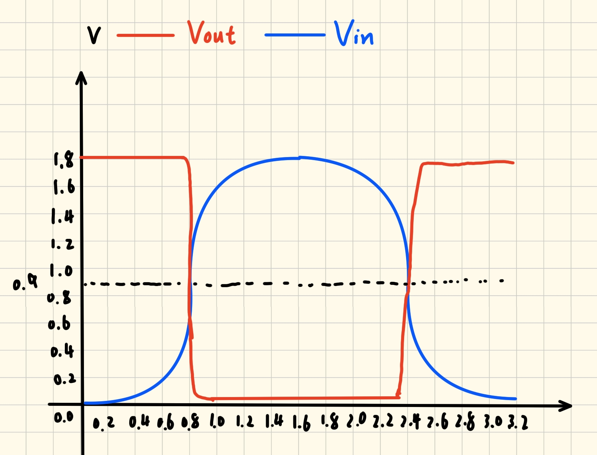
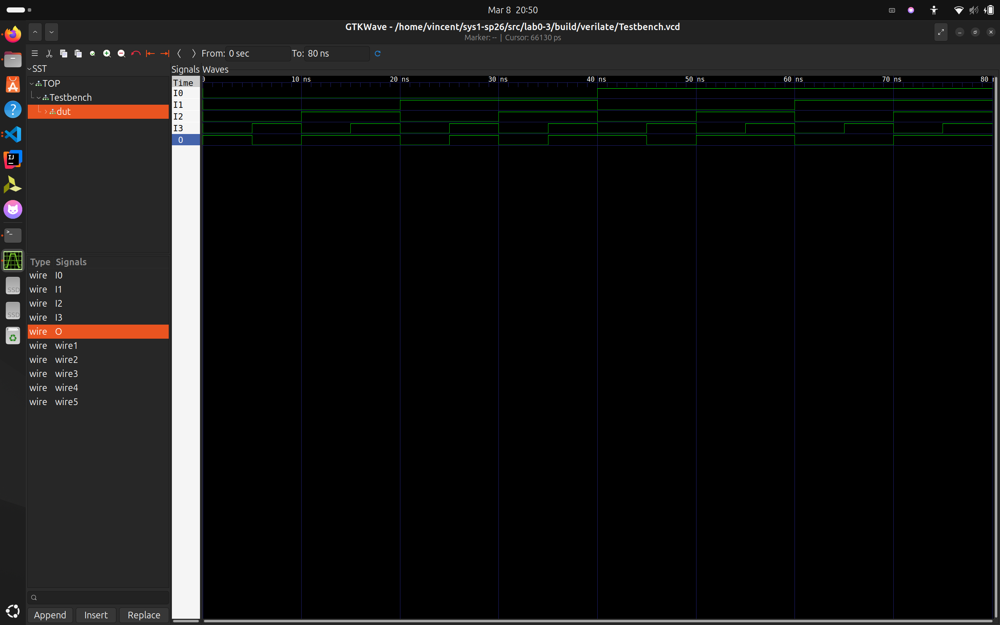
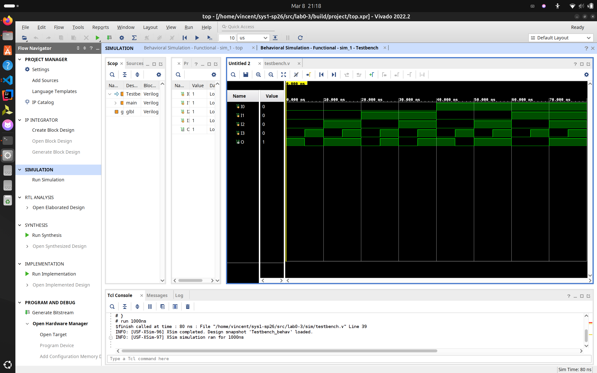

# lab0
___
## lab0-1
### 反相器的电压传输特性

- 实验截图
  

- 输入输出关系
  1. 当输入电压Vin为低电平（接近0V）时，输出电压Vout为高电平（接近1.8V）
  2. 当输入电压Vin为高电平（接近1.8V）时，输出电压Vout为低电平（接近0V）
  3. 当输入电压Vin在0.8v~0.9v附近发生变化时，输出电压发生剧烈变化，从高电平跳变到低电平

- 正弦变化的输入电压
  
  描述：Vout在Vin位于0.8v~0.9v附近发生跳变，共发生两次翻转，分别从高电平跳变到低电平和从低电平跳变到高电平。

- 逻辑0/1的阈值设定
  - Vin输入电压0~0.7V为0，1.0~1.8V为1
  - Vout输出电压0.0~0.1V为0，1.7~1.8V为1

### Logisim电路仿真

- 实验截图
  - 绘图过程
  
  
  - 电路仿真
  
  
  
  
 
- **输入输出**
  |  Input   | Output |
  | :------: | :----: |
  | I0 I1 I2 |   O    |
  |  0 0 0   |   0    |
  |  0 0 1   |   1    |
  |  0 1 0   |   1    |
  |  0 1 1   |   0    |
  |  1 0 0   |   1    |
  |  1 0 1   |   0    |
  |  1 1 0   |   0    |
  |  1 1 1   |   1    |

- **实现功能**
  当只有一个input或全部input为真，output为真，其余皆为假

___

## lab0-3

### Verilog练习

- main.v
  ```Verilog
  module main( 
   input I0,
   input I1,
   input I2,
   input I3,
   output O 
    );
   
   wire wire1;
   wire wire2;
   wire wire3;
   wire wire4;
   wire wire5;

   AND_GATE_3_INPUTS #(.BubblesMask(3'b000)) GATES_1(
      .input1(~I1),
      .input2(~I2),
      .input3(~I3),
      .result(wire1)
   );
   AND_GATE_3_INPUTS #(.BubblesMask(3'b000)) GATES_2(
      .input1(~I0),
      .input2(I2),
      .input3(~I1),
      .result(wire2)
   );
   AND_GATE_3_INPUTS #(.BubblesMask(3'b000)) GATES_3(
      .input1(~I0),
      .input2(I1),
      .input3(I3),
      .result(wire3)
   );
   assign wire4 = I2 & I3;
   assign wire5 = I0 & I2;

   OR_GATE_4_INPUTS #(.BubblesMask(4'h0)) GATES_4(
      .input1(wire1),
      .input2(wire2),
      .input3(wire3),
      .input4(wire4 | wire5),
      .result(O)
   );
    endmodule

- **代码解释**
  - 函数表达式为F(A,B,C,D)=$\overline{\text{BCD}}$+$\overline{\text{A}}$C$\overline{\text{B}}$+$\overline{\text{A}}$BD+CD+AC
  - 则需要五条wire分别代表每个**和取子句**的输出，并将五条wire的输出接入**五路与门**来实现
  - 使用现有的**三路与门**和&可以轻松表达和取子句，因为没有五路或门而使用现有的四路或门，需要将两条wire的输出用|合并作为四路或门的一条输入
  - #(.BubblesMask(3'b000))的使用：由于直接拷贝的lab0-2的三路与门和四路或门，而这两个代码是自动生成的，运用了**BubblesMask参数**，我最开始并没有注意到这个问题，导致仿真结果出错，经由AI的查询，明白要设置参数，**希望望与门直接使用这些取反后的信号，而不再进行额外的内部取反。**
---

- top.v
  ```Verilog
  module top(
  input SW0,
  input SW1,
  input SW2,
  input SW3,
  output LD0
    );

  main main1 (
      .I0(SW0),
      .I1(SW1),
      .I2(SW2),
      .I3(SW3),
      .O(LD0)
  );

  endmodule

 - **代码解释**
   - 需要在top模块里面，将FPGA的物理引脚（输入输出端口）连接到main.v
   - 需要在top.v中实例化**main**这个模块，将**top.v**的输入输出端口链接到**main**模块对应的端口上
   - 通**这个模块，将**top.v**的输入输出端口链接到**main**模块对应的端口上
   - 通过.xdc**引脚约束文件**将 Verilog 代码中定义的 **逻辑端口**映射到 FPGA 芯片的**物理引脚**上
---

- nexysa7.xdc
  ```Verilog
    ## IO
    set_property PACKAGE_PIN {J15} [get_ports {SW0}]
    set_property IOSTANDARD {LVCMOS33} [get_ports {SW0}]
    set_property PACKAGE_PIN {L16} [get_ports {SW1}]
    set_property IOSTANDARD {LVCMOS33} [get_ports {SW1}]
    set_property PACKAGE_PIN {M13} [get_ports {SW2}]
    set_property IOSTANDARD {LVCMOS33} [get_ports {SW2}]
    set_property PACKAGE_PIN {R15} [get_ports {SW3}]
    set_property IOSTANDARD {LVCMOS33} [get_ports {SW3}]
    # add IO
    set_property PACKAGE_PIN {H17} [get_ports {LD0}]
    set_property IOSTANDARD {LVCMOS33} [get_ports {LD0}]

---

- **输出结果**
  | Input1 | Input2 | Input3 | Input4 | Output |
  | :----: | :----: | :----: | :----: | :----: |
  |   0    |   0    |   0    |   0    |   1    |
  |   0    |   0    |   0    |   1    |   0    |
  |   0    |   0    |   1    |   0    |   1    |
  |   0    |   0    |   1    |   1    |   1    |
  |   0    |   1    |   0    |   0    |   0    |
  |   0    |   1    |   0    |   1    |   1    |
  |   0    |   1    |   1    |   0    |   0    |
  |   0    |   1    |   1    |   1    |   1    |
  |   1    |   0    |   0    |   0    |   1    |
  |   1    |   0    |   0    |   1    |   0    |
  |   1    |   0    |   1    |   0    |   1    |
  |   1    |   0    |   1    |   1    |   1    |
  |   1    |   1    |   0    |   0    |   0    |
  |   1    |   1    |   0    |   1    |   0    |
  |   1    |   1    |   1    |   0    |   1    |
  |   1    |   1    |   1    |   1    |   1    |

### 仿真练习

- testbench.v
  ```Verilog
  module Testbench;

    reg I0,I1,I2,I3;
    wire O;

    initial begin
        I0 = 0; I1 = 0; I2 = 0; I3 = 0;
        #5;
        I0 = 0; I1 = 0; I2 = 0; I3 = 1;
        #5; 
        I0 = 0; I1 = 0; I2 = 1; I3 = 0;
        #5;
        I0 = 0; I1 = 0; I2 = 1; I3 = 1;
        #5; 
        I0 = 0; I1 = 1; I2 = 0; I3 = 0;
        #5; 
        I0 = 0; I1 = 1; I2 = 0; I3 = 1;
        #5;  
        I0 = 0; I1 = 1; I2 = 1; I3 = 0;
        #5; 
        I0 = 0; I1 = 1; I2 = 1; I3 = 1;
        #5; 
        I0 = 1; I1 = 0; I2 = 0; I3 = 0;
        #5; 
        I0 = 1; I1 = 0; I2 = 0; I3 = 1;
        #5; 
        I0 = 1; I1 = 0; I2 = 1; I3 = 0;
        #5; 
        I0 = 1; I1 = 0; I2 = 1; I3 = 1;
        #5; 
        I0 = 1; I1 = 1; I2 = 0; I3 = 0;
        #5; 
        I0 = 1; I1 = 1; I2 = 0; I3 = 1;
        #5; 
        I0 = 1; I1 = 1; I2 = 1; I3 = 0;
        #5; 
        I0 = 1; I1 = 1; I2 = 1; I3 = 1;
        #5; 
        $finish;
    end

    main dut( 
        .I0(I0),
        .I1(I1),
        .I2(I2),
        .I3(I3),
        .O(O) 
    );

    `ifdef VERILATE
		initial begin
			$dumpfile({`TOP_DIR,"/Testbench.vcd"});
			$dumpvars(0,dut);
			$dumpon;
		end
    `endif
    
    endmodule

---

- **代码解释**
    - 在initial块里给reg寄存器赋值，由于有四个输入，需要进行十四组测试
    - 延迟五个单位延迟 5 个时间单位是为了让 I0 I1 I2 I3 在给定输入下的输出可以维持 5 个单位的固定电平，便于通过波形观察 O 的输出电平。如果立刻修改输出会导致 O 的值立刻变换，使得上一组输入对应的输出无法观察得到。
  
- **仿真截图**
  
  
