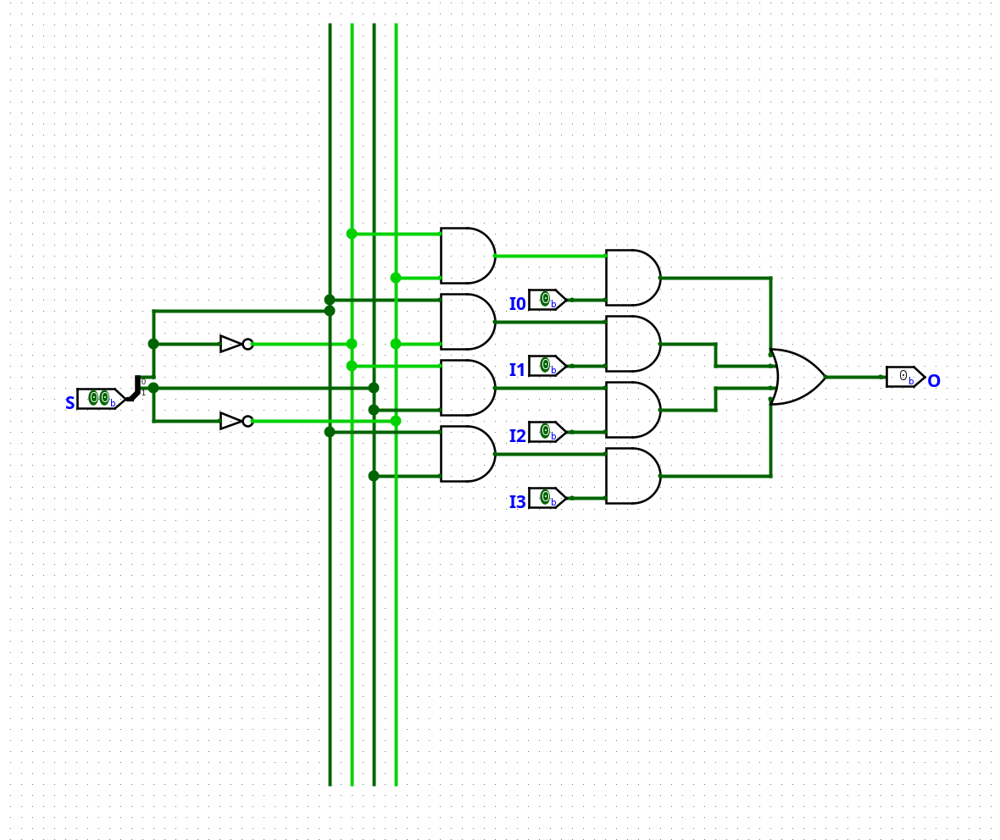
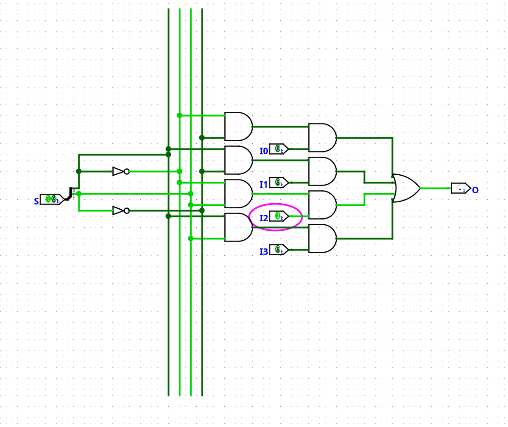
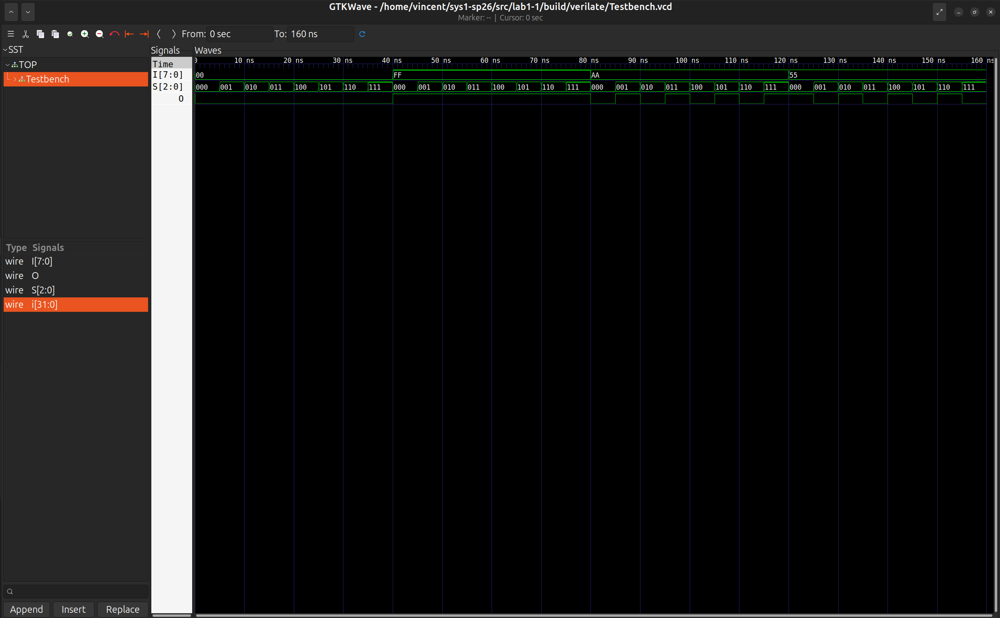
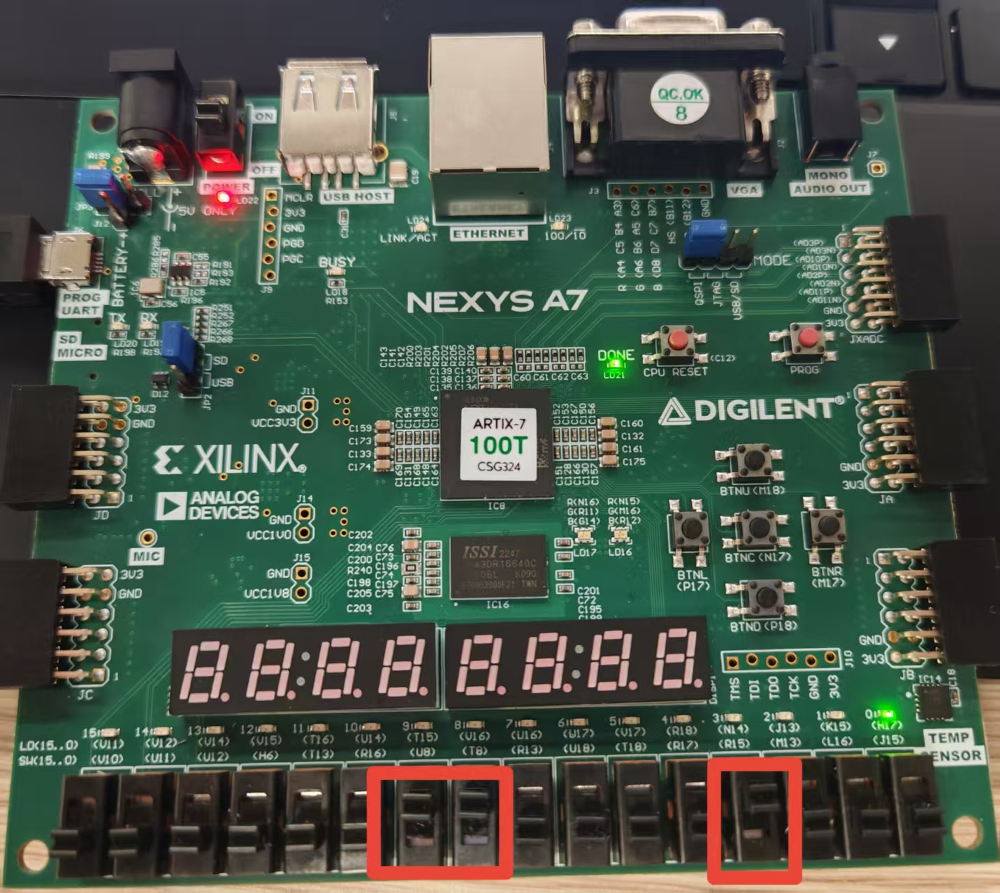
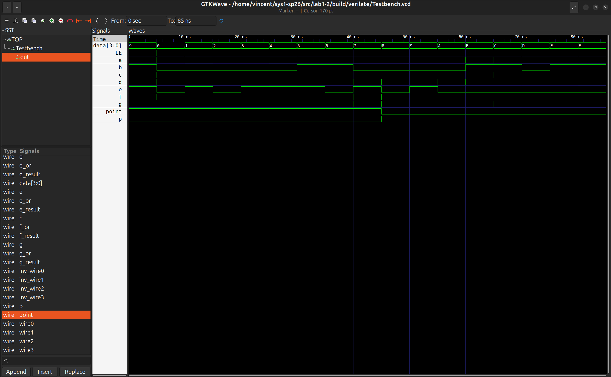
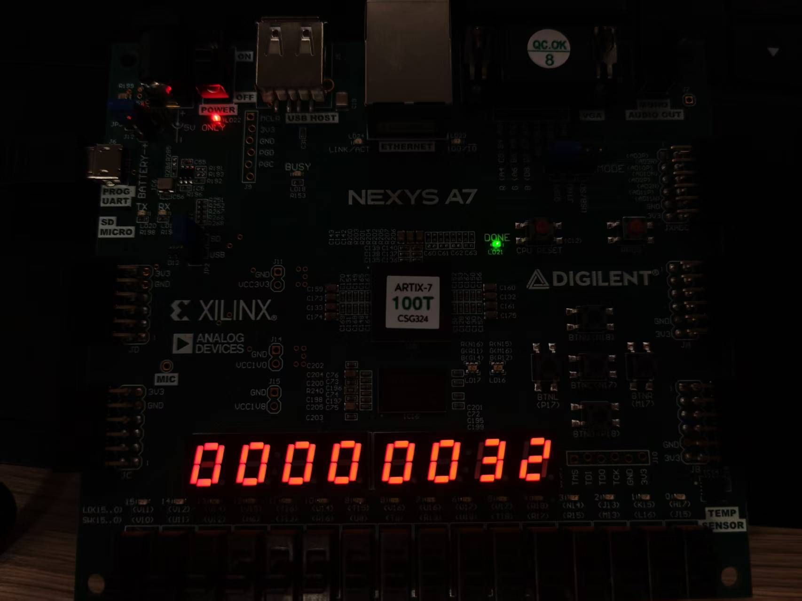
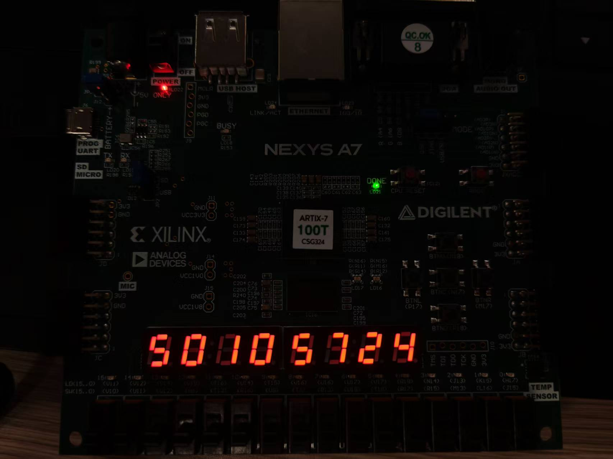
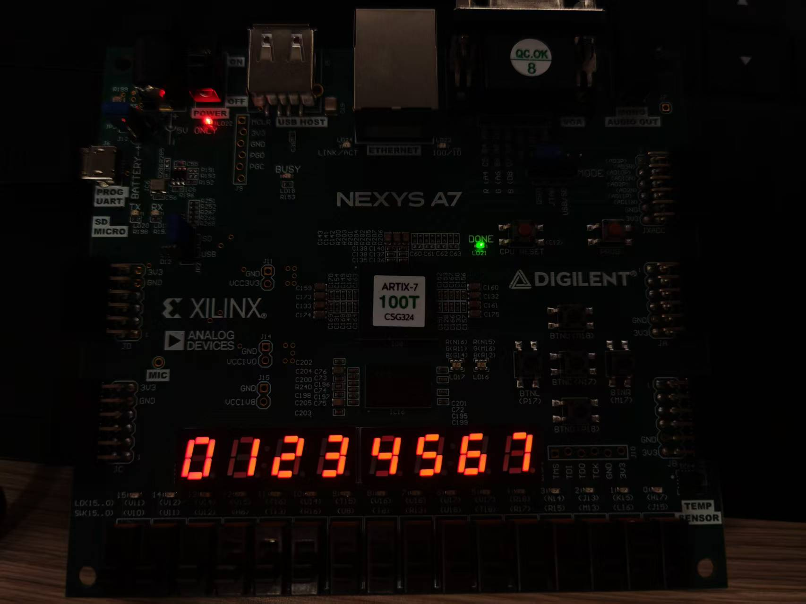
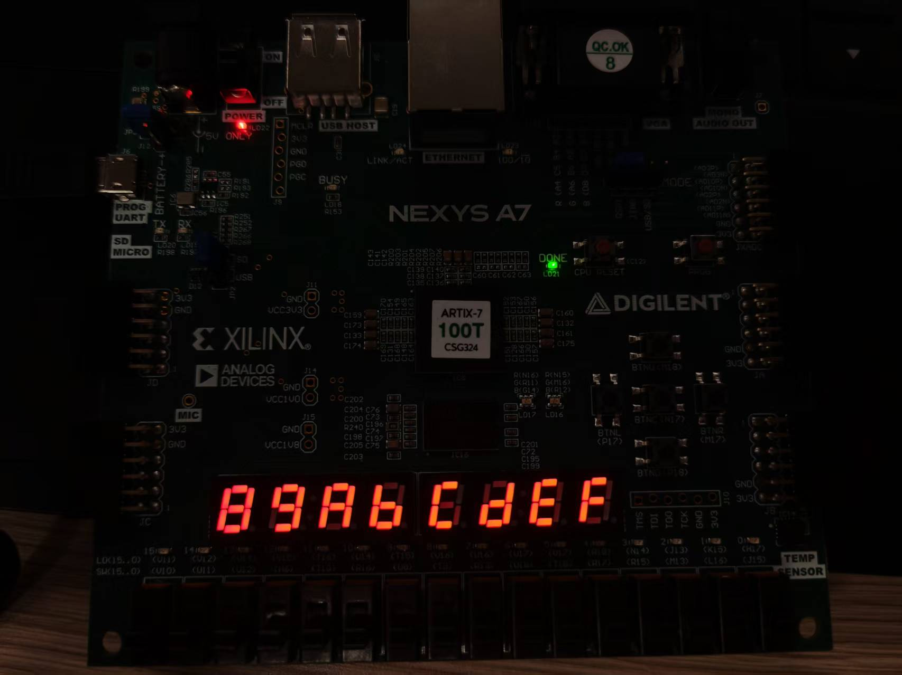
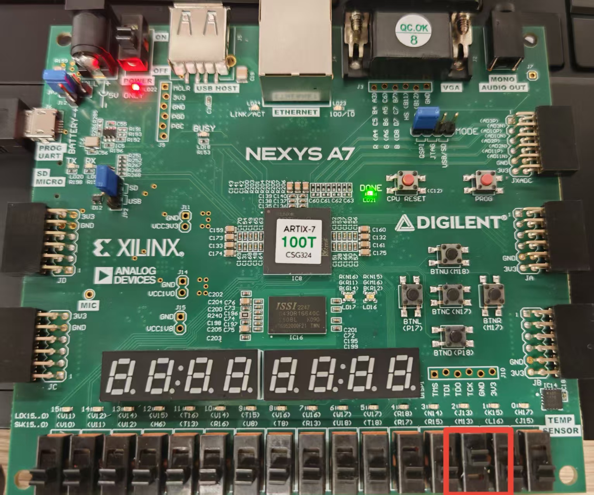

# lab1
---
## lab1-1

### 一、四路选择器原理图
1. **原理图**

解释：根据卡诺图化简得到的逻辑表达式所对应的电路图
    O = (~ S~0~)(~ S~1~)I~0~ + S~0~S~1~I~1~ + (~ S~0~)S~1~I~2~ + S~0~S~1~I~3~
2. **logism电路仿真样例**
- 仿真样例截图

- 预期结果：
  | S[1:0] | 输出 O |
  | :----: | :----: |
  | 2'b00  |   I0   |
  | 2'b01  |   I1   |
  | 2'b10  |   I2   |
  | 2'b11  |   I3   |

### 二、八路选择器代码

- Mux8T1_1.v
```Verilog
module Mux8T1_1( 
   input [7:0] I,
   input [2:0] S,
   output O 
);

   wire O1, O2;
   Mux4T1_1 mux_1(
      .I0(I[0]),
      .I1(I[1]),
      .I2(I[2]),
      .I3(I[3]),
      .S(S[1:0]),
      .O(O1)
   );

   Mux4T1_1 mux_2(
      .I0(I[4]),
      .I1(I[5]),
      .I2(I[6]),
      .I3(I[7]),
      .S(S[1:0]),
      .O(O2)
   );
   
   assign O = (S[2] & O2)| (~S[2] & O1);

endmodule
```
1. 代码解释
    1. 我们可利用四路选择器加上二路选择器来实现八位选择器。
    2. 从输出出发，先使用二路选择器，选择其中的四路输出，再使用四路选择器，从剩下四路中选择一个
2. 实现效果：
    对任意一个**输入I**，由S的取值决定**输出O**的取值是I的第几位

### 三、TestBench设计

1. **设计原理**：对于给定的I，遍历所有的S取值，通过仿真检查输出是否为I的对应位的值
2. **思路**：如果选择遍历所有I的256种取值，则共计产生**256x8=2048**个结果，**仿真结果不易查看**，且过于耗时费力，因此，我选择使用**典型值+边界值**来证明选择器可以正确将I[S]输出。
3. **for语句的使用**：经查找资料，学习到了使用for循环给S赋值的方法，以使代码更加简洁
4. **测试样例选取**：
   1. **I = 8b'00000000**（边界情况）：无论S如何变化，O都应该为0；
   2. **I = 8b'11111111**（边界情况）：无论S如何变化，O都应该为1；
   3. **I = 8b'10101010**（特例）：检测O是否和I[S]对应：S为偶数时，O为0；S为奇数时，O为1； 
   4. **I = 8b'01010101**（特例）：检测O是否和I[S]对应：S为奇数时，O为0；S为偶数时，O为1； 
   
5. **代码实现**:
```Verilog
module Testbench;

    reg [7:0] I;
    reg [2:0] S;
    wire O;

    integer i;
    initial begin
        // test 1:I=0,无论S如何变化，O都应该为0 
        I = 8'b00000000;
        for (i = 0; i < 8; i = i + 1) begin
            S = i[2:0];
            #5;
        end

        // test 2:I=255,无论S如何变化，O都应该为1
        I = 8'b11111111;
        for (i = 0; i < 8; i = i + 1) begin
            S = i[2:0];
            #5;
        end
        
        // test 3:I=8'b10101010),当S为偶数时O应该为0，当S为奇数时O应该为1
        I = 8'b10101010;
        for (i = 0; i < 8; i = i + 1) begin
            S = i[2:0];
            #5;
        end

        // test 4:I=8'b01010101),当S为偶数时O应该为1，当S为奇数时O应该为0
        I = 8'b01010101;
        for (i = 0; i < 8; i = i + 1) begin
            S = i[2:0];
            #5;
        end

        $finish;    
    end

    Mux8T1_1 dut( 
        .I(I),
        .S(S),
        .O(O) 
    );

    `ifdef VERILATE
		initial begin
			$dumpfile({`TOP_DIR,"/Testbench.vcd"});
			$dumpvars(0,dut);
			$dumpon;
		end
    `endif
    
endmodule
```

5. **仿真截图**


### 四、综合下板验证

- **仿真解释**：SW0 ~ 7代表I的八位输入，图中开启SW3;SW8 ~ 10 表示**控制信号**，图中开启SW8 SW9，结果，输出为1，符合预期结果。


### 五、思考题
1. **Mux2T1_1**是由一个**1-to-2-Line Decoder**和两个**AND GATE**和一个**OR GATE**构成
   - **1-to-2-Line Decoder**用于将S信号转换为两个相反的信号；
   - **AND GATE**：使得两个相反的控制信号可选择I0 I1中的一个能通过
   - **OR GATE**：将两个与门输出合并为一路，因为该结构同一时间只有一个有效数据，或门可将有效数据传递到输出端
  
2. **Mux4T1_1的组成**：Mux4T1_1由一个**2-to-Line Decoder**和四个**AND**门和一个**OR**门组成
   - **2-to-4-Line Decoder**用于将S[1:0]转化为四个不同的控制信号，和Mux2T1_1选择器类似，通过四个不同控制信号，选择四个输入信号通过**ANG GATE** ，**OR GATE**的作用和Mux2T1_1的与门相同。 

3. **Mux8T1_1的组成**:
   - 通过两个**Mux4T1_1**和一个**Mux2T1_1**合并而得到的八路选择器
   - 也可以由一个**3-to-8-Line Decoder**和八个**AND GATE**和一个**OR GATE**构成，结构和Mux2T1_1，Mux4T1_1构成

4. **Mux2^m^T1_n的组成**：
   - **Mux2T1_n的组成**：使用n个Mux2T1_1并联实现，分别控制输入信号中的其中一位，且所有位使用相同的选择信号。内部结构与Mux2T1_1相同。
   - **Mux2^m^T1_n的组成**：
    *第一层*：使用2个**Mux2^m-1^T1_n**和一个**Mux2T1_n**构成；结构和Mux8T1_n类似  
    *第二层*：每个**Mux2^m-1^T1_n**由2个**Mux2^m-2^T1_n**和一个**Mux2T1_n**构成
    以此类推……直到整个结构都使用**Mux2T1_n**构成,共需要2^m^-1个**Mux2T1_n**

## lab1-2

### 译码管设计
1. **代码实现**

    ```Verilog
    `timescale 1ns / 1ps

    module SegDecoder (
        input wire [3:0] data,
        input wire point,
        input wire LE,

        output wire a,
        output wire b,
        output wire c,
        output wire d,
        output wire e,
        output wire f,
        output wire g,
        output wire p
    );
    
    wire wire0, wire1, wire2, wire3;
    wire inv_wire0, inv_wire1, inv_wire2, inv_wire3;
    assign {wire3 ,wire2, wire1, wire0} = data;
    assign {inv_wire0, inv_wire1, inv_wire2, inv_wire3} = 
     {~wire0, ~wire1, ~wire2, ~wire3};
    
    // minterms for number 0-f
    wire [15:0] and_gate;
    assign and_gate[0] = inv_wire0 & inv_wire1 & inv_wire2 & inv_wire3; // 0
    assign and_gate[1] = wire0 & inv_wire1 & inv_wire2 & inv_wire3; // 1
    assign and_gate[2] = inv_wire0 & wire1 & inv_wire2 & inv_wire3; // 2
    assign and_gate[3] = wire0 & wire1 & inv_wire2 & inv_wire3; // 3
    assign and_gate[4] = inv_wire0 & inv_wire1 & wire2 & inv_wire3; // 4
    assign and_gate[5] = wire0 & inv_wire1 & wire2 & inv_wire3; // 5
    assign and_gate[6] = inv_wire0 & wire1 & wire2 & inv_wire3; // 6
    assign and_gate[7] = wire0 & wire1 & wire2 & inv_wire3; // 7
    assign and_gate[8] = inv_wire0 & inv_wire1 & inv_wire2 & wire3; // 8
    assign and_gate[9] = wire0 & inv_wire1 & inv_wire2 & wire3; // 9
    assign and_gate[10] = inv_wire0 & wire1 & inv_wire2 & wire3; // A
    assign and_gate[11] = wire0 & wire1 & inv_wire2 & wire3; // B
    assign and_gate[12] = inv_wire0 & inv_wire1 & wire2 & wire3; // C
    assign and_gate[13] = wire0 & inv_wire1 & wire2 & wire3; // D
    assign and_gate[14] = inv_wire0 & wire1 & wire2 & wire3; // E
    assign and_gate[15] = wire0 & wire1 & wire2 & wire3; // F
    // fill your code for remaining numbers
    
    // SegDecoder for a
    wire a_or, a_result;
    assign a_or = and_gate[1] | and_gate[4] | and_gate[11] | and_gate[13];
    assign a_result = a_or | LE;
    assign a = a_result;
    
    wire b_or, b_result;
    assign b_or = and_gate[5] | and_gate[6] | and_gate[11] | and_gate[12]
     | and_gate[14] | and_gate[15];
    assign b_result = b_or | LE;
    assign b = b_result;

    wire c_or, c_result;
    assign c_or = and_gate[2] | and_gate[12] | and_gate[14] | and_gate[15];
    assign c_result = c_or | LE;
    assign c = c_result;

    wire d_or, d_result;
    assign d_or = and_gate[1] | and_gate[4] | and_gate[7] | and_gate[10] | and_gate[15];
    assign d_result = d_or | LE;
    assign d = d_result;

    wire e_or, e_result;
    assign e_or = and_gate[1] | and_gate[3] | and_gate[4] | and_gate[5] 
    | and_gate[7] | and_gate[9];
    assign e_result = e_or | LE;
    assign e = e_result;

    wire f_or, f_result;
    assign f_or = and_gate[1] | and_gate[2] | and_gate[3] |and_gate[7] | and_gate[13];
    assign f_result = f_or | LE;
    assign f = f_result;

    wire g_or, g_result;
    assign g_or = and_gate[0] | and_gate[1] | and_gate[7] | and_gate[12];
    assign g_result = g_or | LE;
    assign g = g_result;

    assign p = ~point;
    // fill your code for decoder of b-g and p
    

    endmodule
    ```

2. **代码解释**：
    1. 4-to-16-Line Decoder首先先将四位的输入信号转化为16个输出信号，每个输出代表四位输入信号的一个最小项（将二进制数转换为十六进制）
    2. 根据七段数码管的显示译码关系，通过复合多路选择器实现的译码器关系得到的译码电路，将对应的数码管和对应的最小项并联
    3. 注意最后结果需要与LE进行或运算（由于开发版的数码管为共阳极数码管，输入信号为0时对应数码管亮），确保可由控制信号决定对应数码管的显示
    4. 最后：P的取值为0时显示小数点，则由point  取反得到
3. **仿真截图**：
   
4. **预期结果**：

    | X    | a   | b   | c   | d   | e   | f   | g   |
    | ---- | --- | --- | --- | --- | --- | --- | --- |
    | 1'h0 | 0   | 0   | 0   | 0   | 0   | 0   | 1   |
    | 1'h1 | 1   | 0   | 0   | 1   | 1   | 1   | 1   |
    | 1'h2 | 0   | 0   | 1   | 0   | 0   | 1   | 0   |
    | 1'h3 | 0   | 0   | 0   | 0   | 1   | 1   | 0   |
    | 1'h4 | 1   | 0   | 0   | 1   | 1   | 0   | 0   |
    | 1'h5 | 0   | 1   | 0   | 0   | 1   | 0   | 0   |
    | 1'h6 | 0   | 1   | 0   | 0   | 0   | 0   | 0   |
    | 1'h7 | 0   | 0   | 0   | 1   | 1   | 1   | 1   |
    | 1'h8 | 0   | 0   | 0   | 0   | 0   | 0   | 0   |
    | 1'h9 | 0   | 0   | 0   | 0   | 1   | 0   | 0   |
    | 1'hA | 0   | 0   | 0   | 1   | 0   | 0   | 0   |
    | 1'hB | 1   | 1   | 0   | 0   | 0   | 0   | 0   |
    | 1'hC | 0   | 1   | 1   | 0   | 0   | 0   | 1   |
    | 1'hD | 1   | 0   | 0   | 0   | 0   | 1   | 0   |
    | 1'hE | 0   | 1   | 1   | 0   | 0   | 0   | 0   |
    | 1'hF | 0   | 1   | 1   | 1   | 0   | 0   | 0   |

    （0 = on， 1 = off）
   
### 复合多路选择器
1. **代码实现**
    ```Verilog
    module Mux4T1_32(
        input [31:0] I0,
        input [31:0] I1,
        input [31:0] I2,
        input [31:0] I3,
        input [1:0] S,
        output [31:0] O
    );

        wire [31:0] O1, O2;
        assign O1 = S[0] ? I1 : I0;
        assign O2 = S[0] ? I3 : I2;
        assign O = S[1] ? O2 : O1;

    endmodule
    ```

2. **代码解释**
  - 通过**条件运算符号**(?:)来实现选择逻辑
  - **第一级**：**根据S[0]选择**，若S[0]为1，则O1=I1,O2=I3,否则O1=I2,O2=I4
  - **第二级**：**根据S[1]选择**，若S[1]为1，则O取O2，否则取O1

3. **语法分析**
   1. 该法选择使用条件运算符号，属于**数据流描述**，通过assign赋值语句，描述数据从输入到输出的组合逻辑路径，虽使用抽象较高的？：语法，但仍可**清楚表现数据在电路中的流动方向**
   2. 若使用**行为描述法**：应使用always过程快，对所有可能的输入分支分别对O进行赋值，但是该方法如果条件分支不完整，容易产生**锁存器**，导致产生预期外的结果
   3. 若使用**结构描述法**：应通过低层次模块进行连接，在此处可以实例化32个一位的多路选择器实现，每个一位的多路选择器对应四个输入信号的其中一位，而四个多路选择器**共用同一个控制信号**，以此实现完整选择其中一个输入的功能

### 综合实现数码管
1. **系统构架**
    1. 通过**Mux4T1_32**从**display宏定义的4组32位数据**中选择一个，送入动态扫描模块拆分成8个四位数据交给**SegDecoder**转换
    2. 通过**SegDecoder**将传入的**四位二进制输入**，转换为**十六进制**，再转换为共阳极数码管所需要的译码，输出到所有数码管。
    3. 通过**动态时分复用**实现“同时”显示八个数字（学号）
2. **综合下板验证**





- 当SW2开启时，停止显示


### for语句

1. 关于repo/sys-project/lab1-2/sim/testbench.v 的测试样例
    ```Verilog
    initial begin
        LE=1'b1;
        point=1'b1;
        data=4'h9;
        #5;
        LE=1'b0;
        for(i=0;i<8;i=i+1)begin
            data=i[3:0];
            #5;
        end
        point=1'b0;
        for(i=8;i<16;i=i+1)begin
            data=i[3:0];
            #5;
        end
        $finish;
    end
    ```
2. 对于**for语句**展开的初始化序列
   ```Verilog
   initial begin
        LE = 1'b1;
        point = 1'b1;
        data = 4'h9;
        #5;
        LE = 1'b0;
        // 第一个循环：i从0到7
        data = 4'h0; #5;
        data = 4'h1; #5;
        data = 4'h2; #5;
        data = 4'h3; #5;
        data = 4'h4; #5;
        data = 4'h5; #5;
        data = 4'h6; #5;
        data = 4'h7; #5;
        point = 1'b0;
        // 第二个循环：i从8到15
        data = 4'h8; #5;
        data = 4'h9; #5;
        data = 4'ha; #5;
        data = 4'hb; #5;
        data = 4'hc; #5;
        data = 4'hd; #5;
        data = 4'he; #5;
        data = 4'hf; #5;
        $finish;
    end
    ```
3. 对于**for语句**的理解
   - 在测试中，data的赋值是**连续变化**的，如果手动对**data**进行赋值，代码极其繁琐。则通过for循环，即可遍历所需要的**输入序列**，使得测试代码简洁易懂，
   - 同时，**循环变量i**作为整数，想要赋值给宽度为4的**data**，需要进行位选择操作，i[3:0]即表示取i的第0位到第4位对data进行赋值
   - 通过查询资料得知：这种写法通常只用于**测试平台（testbench）的 initial 块**中，因为 **integer 类型和循环结构是不可综合的**，**综合工具无法将 for 循环直接转为硬件**
4. **喜欢条件运算符号的理由**:
   1. 由于条件运算符号属于**数据流描述**与**行为描述法**的结合体，代码**简洁性**和**可读性**都得到保证
   2. **简洁性**：（？：）减少了代码的复杂程度，仅用一行代码就能实现**Mux2T1_32**的功能
   3. **可读性**：条件表达式本身就源自于选择器，其核心思想就是**通过控制信号来选择其中一个输入信号**，因此一个条件表达式本身就是一个**Mux2T1**，而四路选择器就是将两个二路选择器的结果再筛选一层，即再接入一个二路选择器，这样写与人认知的选择器概念完美结合，且便于记忆

