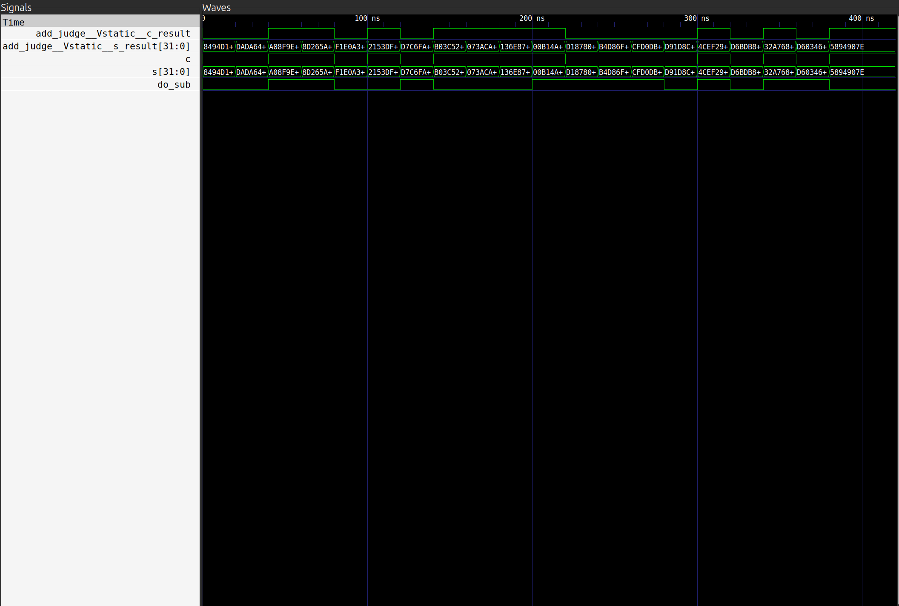

# lab2
---
## 设计行波进位加法器

### 一、1-bit全加器
1. **真值表**
    |   a   |   b   | C~in~ | C~out~ |   s   |
    | :---: | :---: | :---: | :----: | :---: |
    |   0   |   0   |   0   |   0    |   0   |
    |   0   |   0   |   1   |   0    |   1   |
    |   0   |   1   |   0   |   0    |   1   |
    |   0   |   1   |   1   |   1    |   0   |
    |   1   |   0   |   0   |   0    |   1   |
    |   1   |   0   |   1   |   1    |   0   |
    |   1   |   1   |   0   |   1    |   0   |
    |   1   |   1   |   1   |   1    |   1   |

2. **adder.v**
```verilog
module Adder(
    input a,
    input b,
    input c_in,
    output s,
    output c_out
);
    
    wire s_half, c_half;
    assign s_half = a ^ b;
    assign c_half = a & b;
    assign s = s_half ^ c_in;
    assign c_out = c_half | (s_half & c_in);
    
endmodule 
```

3. **代码解释**
   - 设**P = a ^ b, G = ab**
   - 则**C~out~ = G + PC~in~**，**S = P + C~in~**
   - 在代码里面，**s_half**为半加器的s，即**P** ，**c_half**为半加器的进位，即**G**
   - 根据公示可计算出**C~out~，S**

### 二、行波进位加法器

1. **adders.v**
```verilog
module Adders #(
    parameter LENGTH = 32
)(
    input [LENGTH-1:0] a,
    input [LENGTH-1:0] b,
    input c_in,
    output [LENGTH-1:0] s,
    output c_out
);
    wire [LENGTH:0] c;
    assign c[0] = c_in;
    genvar i;
    generate
        for (i = 0; i < LENGTH; i = i + 1) begin : adders
            Adder adder(
                .a(a[i]),
                .b(b[i]),
                .c_in(c[i]),   
                .s(s[i]),
                .c_out(c[i+1])
            );
        end
    endgenerate
    assign c_out = c[LENGTH];

endmodule
```

2. **代码解释**
   - **任意长度**：通过**参数LENGTH**控制全加器的产度，默认设置为**32-bit**
   - **for语句**： 通过**for语句**实现，将每一位数据输入**adder**，并将**C~out~**储存,并作为下一位数据的**C~in~**，最后一位**C~out~**作为整个结果的**C~out~**
   - **： adders**作为标签，使得内部生成的所有adder实例位于adders[i].adder,方便访问

## 三、全加减法器

1. **add_subs.v**
```verilog
module AddSubers #(
    parameter LENGTH = 32
)(
    input [LENGTH-1:0] a,
    input [LENGTH-1:0] b,
    input do_sub,
    output [LENGTH-1:0] s,
    output c
);
    wire [LENGTH:0] c_in;
    assign c_in[0] = do_sub;
    genvar i;
    generate
        for (i = 0; i < LENGTH; i = i + 1) begin : add_subs
            Adder adder(
                .a(a[i]),
                .b(b[i] ^ do_sub), 
                .c_in(c_in[i]),
                .s(s[i]),
                .c_out(c_in[i+1])
            );
        end
    endgenerate
    assign c = c_in[LENGTH];

endmodule
```

2. **代码解释**
   - **控制加减**：在adders的基础上，通过do_sub控制信号，设置**C~0~ = do_sub**，且将B所以位数据与do_sub取异或
   - **do_sub = 0**：做**加法**，**C~0~ = 0**，**B ^ 0 = B**，计算**A+B**
   - **do_sub = 1**：做**减法**，**C~1~ = 1**，**B ^ B = ~B**, 计算**A+(~B)+1**

### 四、仿真测试
1. **testbench.v**

```verilog
integer i
initial begin
    reg [31:0] tem;
    for (i = 0; i < 20; i = i + 1) begin
        a = $random;
        b = $random;
        tem = $random;
        do_sub = tem[0];
        #20; 
    end
    #20;
    $finish;
end
```

2. **代码解释**
   - **for语句**:通过for语句，实现二十组随机测试数据的生成，初始化i = 0，每进行一组测试数据的赋值，就延迟二十个单位时间确保差分测试正常进行，并将i + 1，当 i = 20（即循环二十次后）退出循环
   - **$$random()生成仿真样例$**： **$random函数**将随机生成宽度为**32位**的随机数，可直接给a，b赋值，但是**do_sub**宽度为1，不能直接赋值，则设计一个中间变量**reg[31:0] tem**用与接受生成的随机数，使**do_sub**取tem的第一位，即**tem[0]**完成随机选择加法或减法

3. **仿真截图**
   
   - 仿真解释：do_sub控制加减法，使用**judge.v**生成对拍器,与待测电路的仿真波形对比，两者**输出完全一致**，没有问题

### 五、思考题
#### 第一题
   1. **8行数据**会分别初始化**adder[0]到adder[7]**
   2. **初始化形式**，将读取到的**十六进制字符**，转化为**四位的二进制表示**，存入该adder从高位到低位的四个bit
   3. **结果**：**0123456789abcdef** -> **64'h0123456789abcdef**即把十六进制数转换为二进制存入adder

#### 第二题
1. **行波进位加法器**
    - **优点**：**结构简单**，只需要将全加器串联即可，**门输入成本低**，仅需要全加器的开销
    - **缺点**：每一位输出都要等上一位的加法器结束后才能运行，**延迟高**，时间成本高，
2. **超前进位加法器**
   - **优点**：**延迟低**；可以同时计算每一位的数据的进位
   - **缺点**：**结构复杂**，需要很多的额外的运算，**门输入成本高**，需要很多的额外运算门的开销

### 第三题
1. **OF = C~i~ ^ C~i-1~**（减法被全加减法器转化为加法，所以在此我只讨论加法）加法溢出情况，只可能为两种情况，溢出只可能是同号数相加（也就是**两正/负数相加**），也就是符号位的**进位输入**和**进位输出**不同时，结果的符号位和两个运算数都不同，发生溢位(Overflow:**OF**)
2. **C~i~ = G~i-1~ + P~i-1~G~i-2~ + ...... + P~i-1~P~i-2~...P~0~c~0~**
3. **C~i-1~ = G~i-2~ + P~i-2~G~i-3~ + ...... + P~i-3~P~i-3~...P~0~c~0~**
4. **OF = C~i~ + C~i-1~**