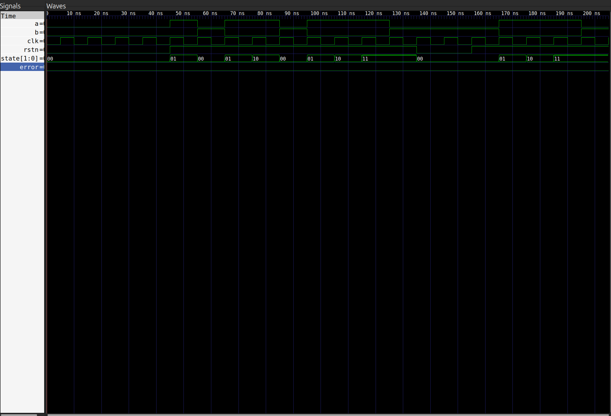
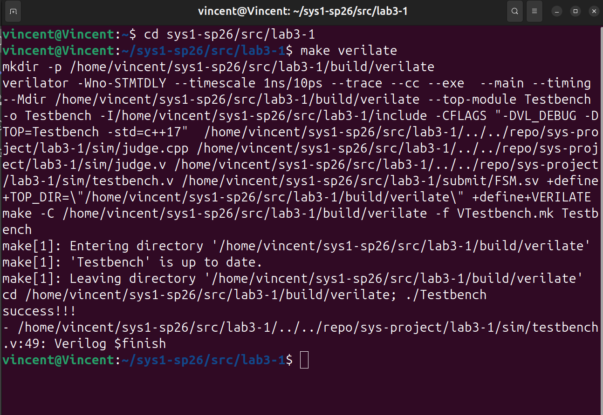
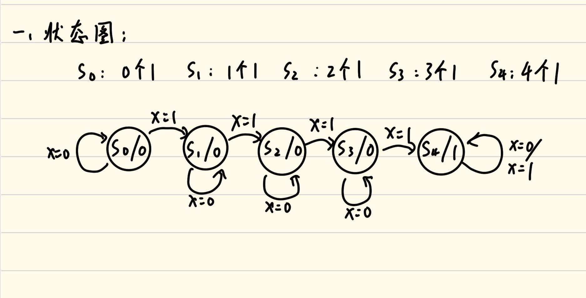
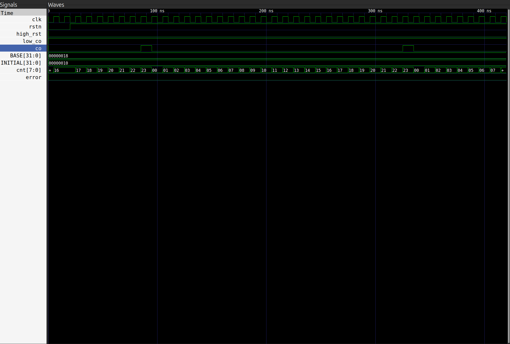
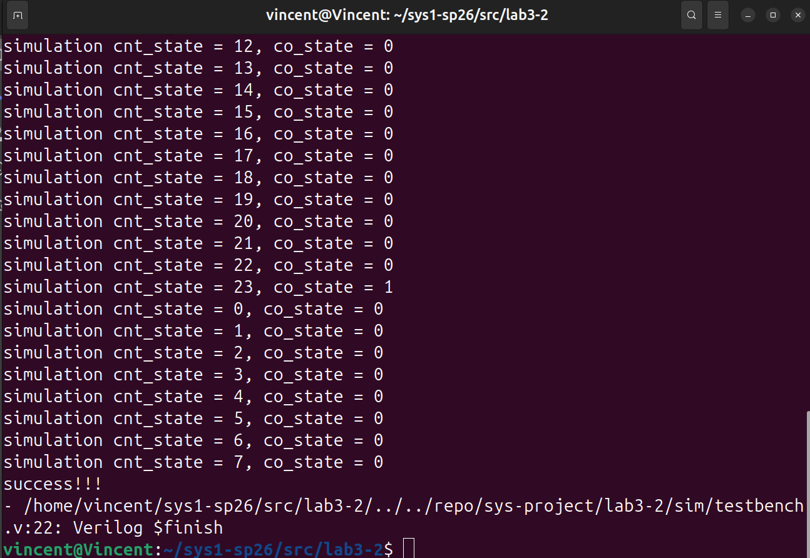
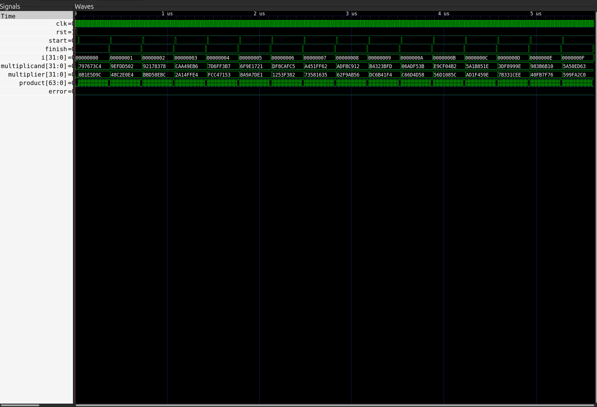
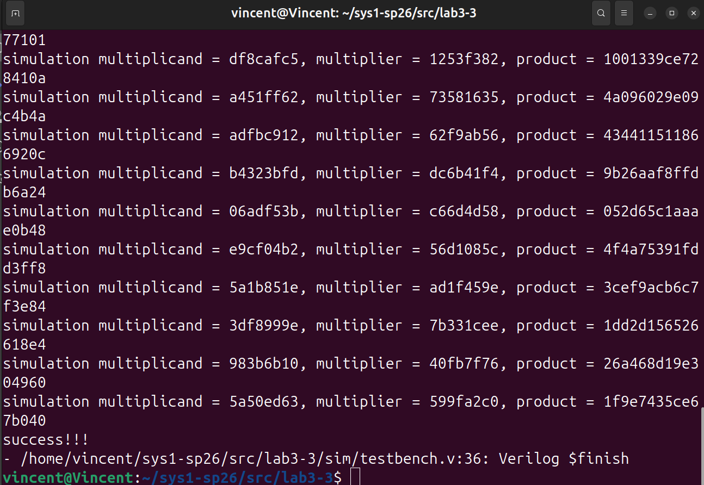

### lab3
---

## lab3-1

### 设计简单的有限状态机

#### 一、使用enum语法设计FSM

- **设计思路**：
  1. 采用enum枚举方法实现有限状态机，先使用enum定义一个枚举类型，由于该状态机只有四个状态，该类型宽度设为**2位**即可，即使用两位数据表示四个状态
  2. `{S0,S1,S2,S3}`一次性枚举常量，分别代表四个状态
  3. **异步复位**，当复位信号处于低电平，直接将状态置S0
  4. **同步更新**，当时钟上沿到来时，根据当前状态和输入X，通过状态表决定跳转到哪个状态
   
- **代码实现**：
<style>
pre, code {
    page-break-inside: auto !important;
    white-space: pre-wrap !important; 
    word-break: break-all !important;
}

.hljs {
    overflow: visible !important; 
}
</style>

```verilog
module FSM(
    input rstn,
    input clk,
    input a,
    input b,
    output [1:0] state
);
    typedef enum logic [1:0] {S0, S1, S2, S3} fsm_state;
    fsm_state state_reg;
    always @(posedge clk or negedge rstn) begin
        if(~rstn) begin
            state_reg <= S0;
        end
        else begin
            case(state_reg) 
                S0: if(a == 0 && b == 1) state_reg <= S0;
                    else if(a == 1) state_reg <= S1;
                    else state_reg <= S0;

                S1: if(a == 0 && b == 1) state_reg <= S0;
                    else if(a == 1) state_reg <= S2;
                    else state_reg <= S1;

                S2: if(a == 0 && b == 1) state_reg <= S0;
                    else if(a == 1) state_reg <= S3;
                    else state_reg <= S2;

                S3: state_reg <= S3;

            endcase
        end
    end

    assign state = state_reg;
endmodule
```

- **仿真截图 & 仿真通过截图**：
<div style="display: flex;">
  
  
</div>


#### 二、思考题

1. **一、enum + case 的编程范式和数组查表的编程范式之间的优劣**
   - **可读性**：**enum + case**的编程范式更加直观体现**状态之间的转换**,而**查表法**数据需要转换才能理解含义，看起来不直观
   - **易修改**：**enum + case**不易修改，每次需要修改所有的switch分支，容易遗漏，**数组查表**只需要扩展表格，不用修改核心循环，更好维护和修改
   - **适用范围**：**enum + case**适合状态少并转换关系复杂的FSM，**数组查表**适合状态多，转换规则简单的FSM
2. **二、要求有限状态机的状态图和状态转移表**
   - **状态表**：
<div style="display: flex;">
  
</div>

   - **状态转移表**：

| present state | X   | Next state | Output |
| ------------- | --- | ---------- | ------ |
| S0            | 0   | S0         | 0      |
| S0            | 1   | S1         | 0      |
| S1            | 0   | S1         | 0      |
| S1            | 1   | S2         | 0      |
| S2            | 0   | S2         | 0      |
| S2            | 1   | S3         | 0      |
| S3            | 0   | S3         | 0      |
| S3            | 1   | S4         | 1      |
| S4            | 0   | S4         | 1      |
| S4            | 1   | S4         | 1      |

3. **有限状态机电路实现的不足**：

    ```verilog
    always@(posedge clk)begin
    if(~rstn) state <= 2'b01;
    else state[1:0] <= state[0:1];
    end
    ```
  - **实现功能**：初始状态为`01`，每个时钟上沿到来时，将state实现从`01`和`10`之间的来回切换
  - **不足之处1**：该写法为同步复位，只有时钟上沿时`rstn`为低电平才会被成功初始化，如果复位信号很短，在时钟上沿前就恢复高电平，就可能无法成功复位，使得整个触发器保持在非法状态，建议改成异步触发`alswys@(posedge clk or negedge rstn)`
  - **不足之处2**：缺少外部控制，该状态机只能实现两个状态不受任何外部输入控制，实际作用很小，不如直接使用clk信号
  - **不足之处3**：设计时没有使得4个状态都合法，一旦出现波动使得系统出现`00`和`11`，系统将无法修复，所有逻辑功能全部错误，应该加入default分支直接回到初始状态
  
## lab3-2

### 计数器/定时器设计与应用

#### 一、实现计数器模块Cnt

- **设计思路**：
  1. **模数可设置**：在调用时`BASE`可设置，默认为10，即计数值从0到9，当计数为9且有低位输入`low_co`时，产生进位信号并将计数值归“零”（归到基础值） 
  2. **进位信号**：`co`作为进位信号，只有计数为`BASE-1`且同时有`low_co`和`en`时产生.
  3. **使能信号**：`en`作为全局使能信号，当en=1时，计数器才开始接受`low_co`,`high_rst`
  4. **低位输入**：`low_co`作为低位的输入/进位信号，当时钟上沿到来时，计数器只有在`en && low_co`时递增
  5. **高层复位**：`high_rst`用于非模数溢出时强制归零，而不是回到初始值，为了BCD码计数器的实现设计的控制信号
  6. **底层Cnt复位**：低位的Cnt有两种复位可能，一种是达到自身BASE，一种为达到整个计数器的BASE通过上层复位信号复位
   
- **代码实现**：

```verilog
    module Cnt #(
    parameter BASE = 10,
    parameter INITIAL = 0
) (
    input en,
    input clk,
    input rstn,
    input low_co,
    input high_rst,
    output co,
    output reg [3:0] cnt
);
    assign co = (cnt == BASE - 1) && en && low_co;
    
    always @(posedge clk or negedge rstn) begin
        if(!rstn) begin
            cnt <= INITIAL;
        end else if(en && high_rst) begin
            cnt <= 0;
        end else if(en && low_co) begin
            if(cnt == BASE - 1) begin
                cnt <= 0;
            end else begin
                cnt <= cnt + 4'b1;
            end
        end
    end
endmodule
```
#### 二、设计24-BCD码计数器Cnt2num

- **设计思路**：
  1. **实现框架**:通过实例化两个Cnt.sv来实现模24的BSC码计数器，输出八位的BCD码(高四位表示十位上数字的二进制，低四位表示个位上数字的二进制),分别为两个Cnt的输出
  2. **全局使能信号**:使能信号作用在全局，只用en=1，计数器才会出现除复位以外的状态改变
  3. **进位信号**：基础仍然为`cnt输出 = BASE-1 && en && low_co`，只不过在BCD码计数器中，cnt输出应该分高位cnt和低位cnt，分别和BASE的高四位和第四位比较，
  4. **高层复位信号**：如果BASE的个位与低位Cnt的BASE不同，就需要`high_rst`强制将Cnt置零
  5. 高位Cnt的`low_co`为低位Cnt的`co`

- **代码实现**：
```verilog
module Cnt2num #(
    parameter BASE = 24,
    parameter INITIAL = 16
)(
    input en,
    input clk,
    input rstn,
    input high_rst,
    input low_co,
    output co,
    output [7:0] cnt
);

    localparam HIGH_BASE = 10;
    localparam LOW_BASE  = 10;
    localparam HIGH_INIT = INITIAL/10;
    localparam LOW_INIT  = INITIAL%10;
    localparam HIGH_CO   = (BASE-1)/10;
    localparam LOW_CO    = (BASE-1)%10;
    
    wire [3:0] cnt_high,cnt_low;
    wire low_co_to_high;
    wire inner_high_rst;
    assign cnt = {cnt_high, cnt_low};
    assign co = (cnt_high == 4'(HIGH_CO)) && (cnt_low == 4'(LOW_CO)) && en && low_co;
    assign inner_high_rst = high_rst || co;

    Cnt #(
        .BASE(HIGH_BASE),
        .INITIAL(4'(HIGH_INIT))
    ) high_cnt (
        .en(en),
        .clk(clk),
        .rstn(rstn),
        .high_rst(inner_high_rst),
        .low_co(low_co_to_high),
        .co(),
        .cnt(cnt_high)
    );

    Cnt #(
        .BASE(LOW_BASE),
        .INITIAL(4'(LOW_INIT))
    ) low_cnt (
        .en(en),
        .clk(clk),
        .rstn(rstn),
        .high_rst(inner_high_rst),
        .low_co(low_co),
        .co(low_co_to_high),
        .cnt(cnt_low)
    );

endmodule
```

- **仿真截图 & 仿真通过截图**：
<div style="display: flex;">
  
  
</div>

#### 三、思考题

1. **使用Cnt2num. sv实现1234 BCD码计数器设计思路**：
   - **实例化**两个Cnt2num. sv，分别处理高二位和低二位，高二位：`BASE=13，INITIAL=0`,低二位：`BASE=100,INITIAL=0`
   -  高两位的`low_co`为低两位的`co`
   -  此时已经形成了一个模1300的BCD码计数器，最后通过高层复位实现模1234
   -  设置复位信号为，当高两位输出为12，低两位输出为33，且用使能信号，有低位输入时，给两个模块的`high_rst`同步施加一个脉冲，使得整个计数器复位

2. **co,low_co,high_rst引脚的意义**：

| 引脚     | 意义                                                                                                                                                                                                       |
| -------- | ---------------------------------------------------------------------------------------------------------------------------------------------------------------------------------------------------------- |
| co       | 进位输出：当本级计数器达到最大值（BASE-1）且 low_co 有效时，co 有效。用于连接上级计数器，作为上级计数器的低位输入使高位计数器递增                                                                          |
| low_co   | 低位进位输入：对于高位计数器，low_co来自低一级计数器的 co，决定本级是否递增。对于最底层计数器，该引脚接常有效信号，以使其可自由计数。利用该引脚可以使每一级计数器正确递增                                  |
| high_rst | 上层强制复位：当整体计数值到达非低级计数器自然溢出的边界（如从23跳回0，而低位计数器只有在达到10，而不是3时才会复位）时，用此信号将所有计数器同步复位到初始值，通过顶层控制底层复位，以实现各个模数的计数器 |

- **总结**：三个引脚将多个计数器有效连接，实现了多位的BCD码计数器。并通过`high_rst`信号，实现从到只能为整数的BCD码计数器，到可以实现任何模数的BCD码计数器


### lab3-3

#### 一、乘法器的实现（multiplier）

- **设计思路**：
  1. **设计架构**：状态机控制三个状态：
     1. **IDLE**:检测到**start**后，初始化数据进入`WORK`状态，开始计算过程，而不接受到`start`信号就保持在`IDLE`状态
     2. **WORK**：通过`work_cnt`控制计算过程循环32次，每次时钟周期完成一次移位相加步骤，并使得`work_cnt`递增，当`work_cnt`与位数相等时，跳转到`FINAL`状态，不然下个周期仍在`WORK`状态
     3. **IDLE**:将乘积锁存到输出`product`，并置`finish=1`持续一个周期，完成握手协议，之后回到`IDLE`等待下一次请求。
  2. **移位相加计算过程**：
     1. 如果**product_reg[0] == 1'b0**(即当前乘数最低位为0)，输出锁存器只需要整体右移一位，高位补零，**product_reg <= {1'b0, product_reg[PRODUCT_LEN-1:1]};**   
     2. 如果**product_reg[0] == 1'b1**(即当前乘数最低位为1)，输出锁存器高32位需要和背乘数相加，并整体右移一位，则结果分为两个部分:
        - **高33位**（预留一位确保相加结果不会溢出） **({1'b0, product_reg[PRODUCT_LEN-1:LEN]} + multiplicand_reg)**
        - **低31位**，直接使用原锁存器从[LEN-1:1]的值（即右移后舍弃最后一位），
        - **最后结果**为**product_reg <= {({1'b0, product_reg[PRODUCT_LEN-1:LEN]} + multiplicand_reg),
                 product_reg[LEN-1:1]};** 

- **代码实现**：

```verilog
module Multiplier #(
    parameter LEN = 32
) (
    input clk,
    input rst,
    input [LEN-1:0] multiplicand,
    input [LEN-1:0] multiplier,
    input start,
    
    output [LEN*2-1:0] product,
    output finish
);

    //乘机的位宽
    localparam PRODUCT_LEN = LEN*2;

    //被乘数寄存器
    logic [LEN-1:0] multiplicand_reg;

    //乘积寄存器
    logic [PRODUCT_LEN-1:0] product_reg;

    //计数到LEN需要多少个迭代
    localparam CNT_NUM = LEN - 1;

    //有限状态机设计
    typedef enum logic [1:0] {IDLE, WORK, FINAL} fsm_state;
    fsm_state fsm_state_reg;

    //计数到LEN需要多少位二进制计数器
    localparam CNT_LEN = $clog2(LEN);

    // 迭代需要的立即数，控制乘法循环
    logic [CNT_LEN-1:0] work_cnt;

    reg finish_reg;
    assign product = product_reg;
    assign finish = finish_reg;

    always @(posedge clk or posedge rst) begin
        if (rst) begin
            fsm_state_reg <= IDLE;
        end else begin
            case (fsm_state_reg)
                IDLE: begin
                    finish_reg <= 1'b0;
                    if(start) begin
                        multiplicand_reg <= multiplicand;
                        product_reg[PRODUCT_LEN-1:LEN] <= {LEN{1'b0}};
                        product_reg[LEN-1:0] <= multiplier;
                        work_cnt <= 0;
                        fsm_state_reg <= WORK;
                    end else begin
                        fsm_state_reg <= IDLE;
                    end
                end
                WORK: begin
                    if(product_reg[0] == 1'b1) begin
                       product_reg <= {({1'b0,product_reg[PRODUCT_LEN-1:LEN]} + multiplicand_reg), product_reg[LEN-1:1]};
                    end else begin  
                        product_reg <= {1'b0, product_reg[PRODUCT_LEN-1:1]};
                    end
                    work_cnt <= work_cnt + 1;

                    if(work_cnt == CNT_NUM[CNT_LEN-1:0]) begin
                        fsm_state_reg <= FINAL;
                    end else begin
                        fsm_state_reg <= WORK;
                    end
                end
                FINAL: begin
                    finish_reg <= 1'b1;
                    fsm_state_reg <= IDLE;     
                end
                default : fsm_state_reg <= IDLE;
            endcase
        end
    end
    
    
endmodule
```

 - **仿真截图 & 仿真通过截图**：
<div style="display: flex;">
  
  
</div>

#### 二、仿真验证和DPI-C差分测试

- **1.仿真激励文件testbench.v**：
  1. 首先使用用`for`语句生成十五组测试数据 
  2. 使用`@(posedge clk)`等到时钟上沿到来时候用`@random`语句生成随机的测试数据，并发出`start`信号.
  3. 等到下一个时钟周期上沿，将start归零
  4. 使用`wait(finish == 1)`语句直到等到接受到`finish`信号完成握手协议，立即接受数据
  5. 代码实现
        ```verilog
        for(i=0;i<16;i=i+1)begin
            @(posedge clk);
            multiplicand = {$random} % 32'hffff_ffff;
            multiplier = {$random} % 32'hffff_ffff;
            start = 1;
            @(posedge clk);
            start = 0;
            wait(finish == 1);
            @(posedge clk);
        end
        ```

- **2.DPI-C差分测试**：按要求补全接口声明，并完成对应测试程序的算法部分
  
#### 三、思考题

1. **解释仿真测试样例和下板的顶层结构为什么满足 start-finish 握手协议**
    - 仿真样例：start置1的同时向被调用模块发送初始数据，且start信号只发送一个时钟周期，等下一个时钟上沿将start信号归零，等到接受finish信号时接收数据，完成握手协议，并开始下一个周期开始新一轮测试
    - 顶层结构：每次按键给出一个周期的start信号的同时给出初始数据，等到计算完成后输出finish，并通知顶层模块结果有效，读取数据，硬件上保证了不会在finish之前给出下一个start信号，满足start-finish握手协议

2. **start-finish 握手协议存在的缺点和改进的方法**
   - **没有超时检测**：如果callee因为故障始终没有返回finish信号，caller将永久死机，整个程序卡住，没有容错。**改进**：callee增加异常信号，caller增加计时器，超时发送复位信号
   - **caller无法确保接收状态**：如果callee没有运行完，但caller又发送了start信号，calle的数据会被覆盖，导致状态出错，**改进**：增加就位信号，当caller发送start信号，callee即发送就位信号，完成一次握手，确定callee空闲caler才会发送信号
   - **效率低下**：发送start等待finish信号过程，caller没有任务执行，效率低，**改进**：引入多个乘法器结构，使得每个时钟周期caller都可以与其中一个乘法器完成握手，提高caller的效率

3. **设计32bit 无符号整数除法器**：
   - **设计思路**：
     1. **状态机设计**：和乘法器基本一致，IDLE，WORK，FINAL三个状态
     2. **初始化**：初始化dividend，divisor，并将divisor与dividend最高位对齐，商quotient remainder设为0
     3. **运算过程**：把remaninder左移一位，并接入divisor的最高位，divisor左移一位，判断此时remainder是不是大于或等于除数，如果大于余数减去除数，得到新的余数，quotient左移最低位设为1；否则则quotient左移最低位设为0。，循环32次
   - **伪代码**：
      ```verilog
        remainder = 0;
        quotient  = 0;
        for (i = 0; i < 32; i++) {
            // 将余数左移1位，最低位设为被除数当前的最高位
            remainder = [(remainder << 1)[31:1] ,dividend[31]]
            dividend = dividend << 1;//被除数左移一位清除第一位
            if (remainder >= divisor) {
                remainder = remainder - divisor;
                quotient = [(quotient << 1)[31:1] ，1'b1] ;
            } else {
                quotient = quotient << 1;
            }
        }
        // 循环结束后 remainder 即为余数，quotient 为商
        ```
4. **尝试改进目前的有限状态机，使得一次乘法操作或者连续乘法操作消耗的时钟周期数可以减少**:
   1. **增加提前终止标志**：当乘数全为0时，可直接结束**WORK**状态，跳转到**FINAL**，以此减少乘法操作的时钟周期数
   2. **一次读取两位乘数**：在一次时钟周期内，同时进行两位的乘数的读取，并进行运算，可减少一半的时钟周期数
   
5. **解决连续乘法操作消耗时钟周期数**：
   1. 将循环展开为32组寄存器组成的流水线，每个寄存器只负责其中的一步，然后caller端不需要等该次的运算的finish信号，每个时钟周期都传入一组新的数据，并接收一组数据，避免所有哦乘法操作“串行”
   2. 使用多个标准乘法器并联，每个时钟周期都向其中一个乘法器输入初始化数据，并从一个乘法器里接收数据，也可以使连续操作的乘法并行运行


