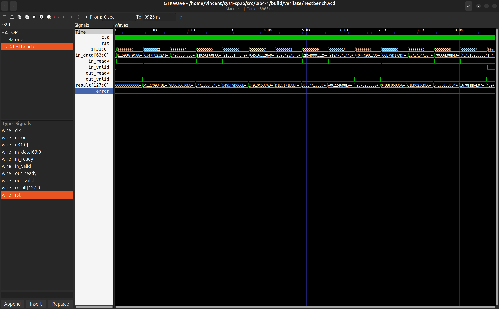
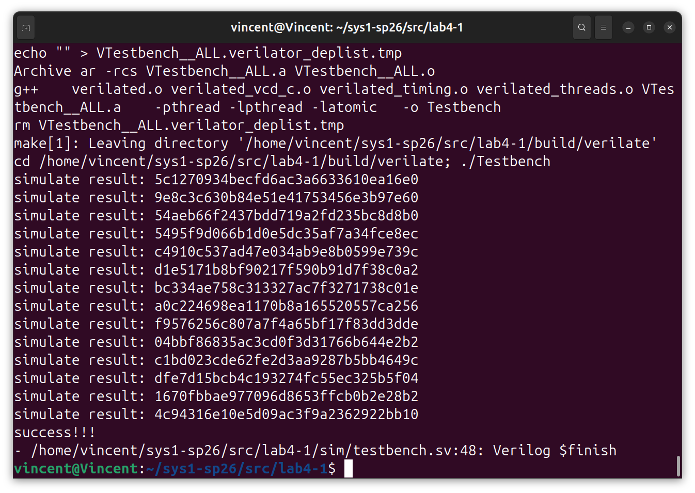
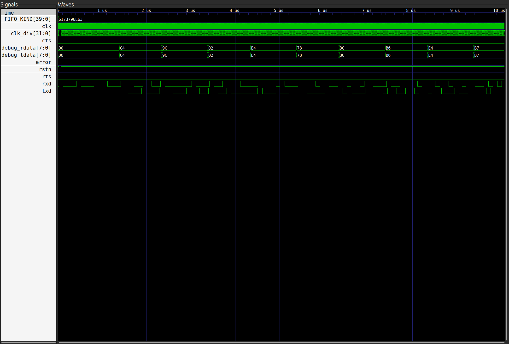
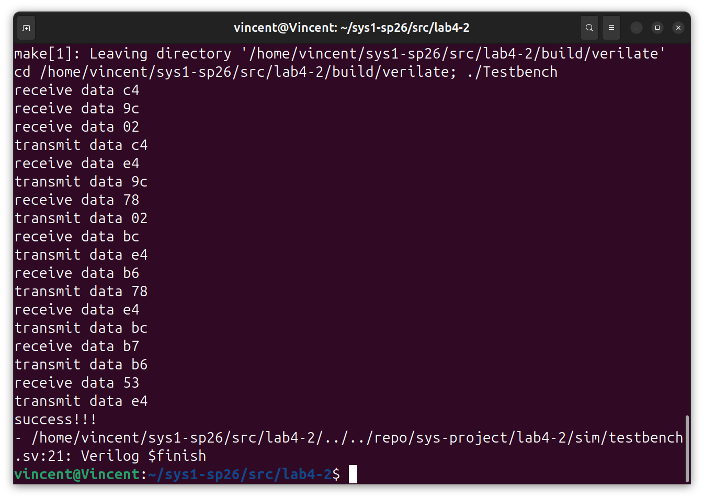

<style>
pre, code {
    page-break-inside: auto !important;
    white-space: pre-wrap !important; 
    word-break: break-all !important;
}

.hljs {
    overflow: visible !important; 
}
</style>

# lab4

---

## lab4-1 卷积模块

### 一、各模块实现

#### 1.1 实现卷积单元

该模块完成 `Shift` `ConvOperator` 模块之间的数据传输，且数据传输采用**valid-ready**协议


- **原始代码**：

```systemVerilog
`include"conv_struct.vh"
module ConvUnit (
    input clk,
    input rst,
    input Conv::data_t in_data,
    input Conv::data_vector kernel,
    input in_valid,
    output in_ready,

    output Conv::result_t result,
    output out_valid,
    input out_ready
);

    // fill the code
    Conv::data_vector data_cache;
    logic in_ready_cache;
    logic out_valid_cache;
    
    Shift shift (
        .clk(clk),
        .rst(rst),
        .in_data(in_data),
        .in_valid(in_valid),
        .in_ready(in_ready),

        .out_ready(in_ready_cache),
        .out_valid(out_valid_cache),
        .data(data_cache)
    );
    

    ConvOperator convOperator(
        .clk(clk),
        .rst(rst),
        .kernel(kernel),
        .data(data_cache),
        .in_valid(out_valid_cache),
        .in_ready(in_ready_cache),

        .result(result),
        .out_ready(out_ready),
        .out_valid(out_valid)
    );
    
endmodule
```

- **代码解释**：
  1. 实例化**shift**和**convOperator**模块，完成**移位器**模块和**卷积计算模块**之间的信号通讯，依旧采用**vaild-ready**协议
  2. 将参数传入两个实例化模块

#### 1.2 实现移位器模块 

- **原始代码**：

```systemVerilog
`include"conv_struct.vh"
module Shift (
    input clk,
    input rst,
    input Conv::data_t in_data,
    input in_valid,
    output reg in_ready,

    output Conv::data_vector data,
    output reg out_valid,
    input out_ready
);

    typedef enum logic {RDATA, TDATA} fsm_state;
    fsm_state state_reg;
    Conv::data_t [Conv::LEN-1:0] data_reg;
    generate
        for(genvar i = 0; i < Conv::LEN; i = i + 1)begin
            assign data.data[i] = data_reg[i];
        end
    endgenerate

    // fill the code

    always @(posedge clk or posedge rst) begin
        if (rst) begin
            state_reg <= RDATA;
            in_ready <= 1'b1;
            out_valid <= 1'b0;
            for(integer i = 0; i < Conv::LEN; i = i + 1) begin
                data_reg[i] <= '0;
            end
        end else begin
            case (state_reg)
                RDATA: begin
                    if (in_valid) begin
                        data_reg[Conv::LEN-1] <= in_data;
                        data_reg[Conv::LEN-2:0] <= data_reg[Conv::LEN-1:1];
                        in_ready <= 1'b0;
                        out_valid <= 1'b1;
                        state_reg <= TDATA;
                    end else begin
                        state_reg <= RDATA;
                    end
                end
                TDATA: begin
                    if(out_ready) begin
                        in_ready <= 1'b1;
                        out_valid <= 1'b0;
                        state_reg <= RDATA;
                    end else begin
                        state_reg <= TDATA;
                    end
                end
            endcase
        end
    end

endmodule
```

- **代码解释**：
  1. 握手协议解释：输入端与**caller**进行握手协议,输出端与  ConvOperator
  2. 将新进入的信息存入最高位，将原有数据向右移位
  3. 通过有限状态机：两个状态**RDATA**（接收数据状态），**TDATA**（发送数据状态）
  4. **RDATA**状态：复位，或当**in—valid==1**时,执行移位，设置in_ready=0（停止接收数据），out_vaild(告诉后端数据就位)跳转到**TDATA**状态
  5. **TDATA**状态：**out_ready==1**则后端成功读取数据，恢复in_valid,out_valid,回到**RDATA**状态，若**out_ready==0**则保持现在状态，所有信号保持不变


#### 1.3 实现卷积计算模块

- **原始代码**：

```systemVerilog
`include"conv_struct.vh"
module ConvOperator(
    input clk,
    input rst,
    input Conv::data_vector kernel,
    input Conv::data_vector data,
    input in_valid,
    output reg in_ready,

    output Conv::result_t result,
    output reg out_valid,
    input out_ready
);

    localparam VECTOR_WIDTH = 2*Conv::WIDTH;
    typedef struct {
        Conv::result_t data;
        logic valid;
    } mid_vector;

    mid_vector vector_stage1 [Conv::LEN-1:0];
    mid_vector vector_stage2;

    typedef enum logic [1:0] {RDATA, WORK, TDATA} fsm_state;
    fsm_state state_reg;
    
    Conv::result_t add_tmp[Conv::LEN-1:1]/* verilator split_var */;

    Conv::result_t mul_product [Conv::LEN-1:0];
    logic start;
    logic [Conv::LEN-1:0] finish;
    logic total_finish;
    logic total_valid;
    assign total_finish = &finish;

    assign result = vector_stage2.data;
    // fill the code

    generate
    for(genvar j = 0;j < Conv::LEN; j = j + 1) begin : vector_mul
        Multiplier mul(
            .clk(clk),
            .rst(rst),
            .multiplicand(kernel.data[j]),
            .multiplier(data.data[j]),
            .start(start),
        
            .product(mul_product[j]),
            .finish(finish[j])
        );
    end
    endgenerate


    generate
        for(genvar i = 1;i<Conv::LEN; i = i + 1) begin
            if(i<Conv::LEN/2) begin
                assign add_tmp[i] = add_tmp[i*2] + add_tmp[i*2+1];
            end else begin
                assign add_tmp[i] = mul_product[(i-Conv::LEN/2)*2] + mul_product[(i-Conv::LEN/2)*2+1]; 
            end
        end
    endgenerate


    always @(posedge clk or posedge rst) begin
        if (rst) begin
            state_reg <= RDATA;
            in_ready <= 1'b1;
            out_valid <= 1'b0;
            start <= 1'b0;

            for(integer k = 0; k < Conv::LEN; k = k + 1) begin
                vector_stage1[k].valid <= 1'b0;
            end
            vector_stage2.valid <= 1'b0;
        end else begin

            case (state_reg)

                RDATA: begin
                    if(in_valid) begin
                        start <= 1'b1;
                        in_ready <= 1'b0;
                        for(integer k = 0; k < Conv::LEN; k = k + 1) begin
                            vector_stage1[k].valid <= 1'b0;
                        end
                        vector_stage2.valid <= 1'b0;
                        state_reg <= WORK;
                    end
                end

                WORK: begin
                    start <= 1'b0;
                    if(total_finish) begin
                        for (integer k = 0; k < Conv::LEN; k = k + 1) begin
                            vector_stage1[k].valid <= 1'b1;
                            vector_stage1[k].data <= mul_product[k];
                        end
                        vector_stage2.data <= add_tmp[1];
                        vector_stage2.valid <= 1'b1;
                        out_valid <= 1'b1;
                        state_reg <= TDATA;
                    end
                end

                TDATA: begin
                    if(out_ready) begin
                        in_ready <= 1'b1;
                        out_valid <= 1'b0;
                        state_reg <= RDATA;
                    end else begin
                        state_reg <= TDATA;
                    end
                end

                default: state_reg <= RDATA;
            endcase
        end

    end

endmodule
```

- **代码解释**：
  1. 分为4个**Multiplier**乘法器模块，**并行加法树**合并四个乘法器模块的乘积结果，**有限状态机**：负责接收数据，完成**握手协议**，接收数据，等待计算结束后,发送数据**

#### 1.4仿真结果


<div style="display: flex;">
  
  
</div>

### 二、思考题

1. **解释仿真测试样例和下板的顶层结构为什么满足 valid-ready 握手协议**
   1. **ConvUnit**保证了**移位器**和**卷积计算模块**之间的握手协议，所以只需要考虑ConvUnit和上层结构之间的握手协议
   2. **仿真测试样例**：**in_valid**满足握手协议，将**in_valid**设为1，一直等到**in_ready==1**才生成下一组数据，无死锁，valid信号不会依赖于ready信号，且保证了等待接收方获取数据之前（in_ready == 0）保持传输的数据不变
   3. **下板的顶层结构**：**dataGenerator**与**ConvUnit**的数据传输满足握手协议，每次按下按钮，in_valid置1，确保其独立性，不会和in_ready形成死锁，最后卷积计算完成和顶层之间的数据传输同样满足**valid_ready**协议


## lab4-2 串口使用

### 一、实验过程及结果

#### 1.1 补全UartLoop，完成回环测试

- **原始代码**：
```systemVerilog
`include"uart_struct.vh"
module UartLoop(
    input clk,
    input rstn,
    Decoupled_ift.Slave uart_rdata,
    Decoupled_ift.Master uart_tdata,
    input UartPack::uart_t debug_data,
    input logic debug_send,
    output UartPack::uart_t debug_rdata,
    output UartPack::uart_t debug_tdata
);
    import UartPack::*;

    uart_t rdata;
    logic rdata_valid;

    uart_t tdata;
    logic tdata_valid;

    assign rdata = uart_rdata.data;
    assign rdata_valid = uart_rdata.valid;

    always_comb begin 
        if(debug_send) begin
            tdata = debug_data;
            tdata_valid = 1'b1;
            uart_rdata.ready = 1'b0;
        end else begin
            tdata = rdata;
            tdata_valid = rdata_valid;
            uart_rdata.ready = uart_tdata.ready;
        end
    end
    // fill the code

    assign uart_tdata.data = tdata;
    assign uart_tdata.valid = tdata_valid;

    assign debug_rdata = rdata;
    assign debug_tdata = tdata;

endmodule
```

- **代码解释**：
  1. 我采用了组合逻辑来实现，通过**uart_rdata**从上位机直接接收数据，再通过**uart_tdata**将数据发回上位机
  2. 增设了调试路径，支持当开关开启，将开关和按钮的数据发送给上位机而不是发送上位机接收的数据
  3. 数据连通，tdata直接等于rdata
  4. **valid**连通：tdata_valid = rdata_valid,只要上游数据有效，就向下游模块发送请求
  5. **ready**连通：**uart_rdata.ready**直接等于**uart_tdata.ready**，只要下游可以接受数据，就不停向上游获取数据

#### 1.2 仿真结果


<div style="display: flex;">
  
  
</div>

#### 1.3 下板结果

> 备注：由于电脑使用的是双系统，没有串口调试软件Mobaxterm，本处使用的是Linux原生串口调试软件


<div style="display: flex;">
  
</div>

### 二、思考题

#### 2.1 设计 async_transmitter 的有限状态机

1. **波特率计数参数**：BAUD_TICKS = ClkFrequency / Baud - 1，即每个bit位需要保持**BAUD_TICKS + 1**个时钟周期，内部维护一个时序逻辑，专门从 **0 计数到 BAUD_TICKS**，并产生**baud_tick**脉冲用于跳转状态

2. **状态机状态定义**：共需要**1个空闲状态IDLE**+**1个起始状态位START**+**8个发送状态D~0~-D~7~**+**2个停止位**

| 状态名 | 描述            | TxD 输出值  | 持续时间               |
| :----- | :-------------- | :---------- | :--------------------- |
| IDLE   | 空闲等待        | 1（高电平） | 不定（等待 TxD_start） |
| START  | 起始位          | 0（低电平） | 1 个波特周期           |
| D0     | 数据位 0（LSB） | TxD_data[0] | 1 个波特周期           |
| D1     | 数据位 1        | TxD_data[1] | 1 个波特周期           |
| D2     | 数据位 2        | TxD_data[2] | 1 个波特周期           |
| D3     | 数据位 3        | TxD_data[3] | 1 个波特周期           |
| D4     | 数据位 4        | TxD_data[4] | 1 个波特周期           |
| D5     | 数据位 5        | TxD_data[5] | 1 个波特周期           |
| D6     | 数据位 6        | TxD_data[6] | 1 个波特周期           |
| D7     | 数据位 7（MSB） | TxD_data[7] | 1 个波特周期           |
| STOP1  | 停止位 1        | 1（高电平） | 1 个波特周期           |
| STOP2  | 停止位 2        | 1（高电平） | 1 个波特周期           |

3. **状态转移逻辑**：每个时钟周期检查**波特率计数器**，如没有**baud_tick**脉冲则保持原来状态不变；如果有，则按照状态表跳转到下一个状态

4. **TxD输出逻辑**：**组合逻辑**，根据当前状态决定TxD的数据:**IDLE，STOP1，STOP2，default置1**；**START置0**;**Di放置TxD_data[i]**

5. **TxD_busy逻辑**：**组合逻辑**：当状态位IDLE时置0，其他状态置1

#### 2.2 描述 async_transmitter 的大致工作流程

1. **空闲状态（IDLE）**
   1. TxD 置 1， TxD_busy = 0

   2. 波特率计数器 **baud_counter** 保持为0

   3. 当检测到 **TxD_start = 1** 时，将**TxD_data**存入**shift_reg**，确保发送过程中外部数据变化不影响本次发送的数据

2. **起始状态（START）**

    1. TxD 值 0，持续 1 个波特周期,TxD_busy = 1

    2. baud_counter 从 0 计数到 BAUD_TICKS，产生 **baud_tick** 脉冲后跳转到 D0

3. **发送数据状态 （D0 ~ D7）**

    1. 每个数据位状态持续 1 个波特周期,即由 **baud_tick** 触发跳转到下一位状态。

    2. TxD 依次输出 shift_reg[0] 到 shift_reg[7]

    3. TxD_busy 持续为1
4. **停止位状态 STOP1 和 STOP2**

    1. TxD 置 1

    2. 每个停止位状态持续 1 个波特周期，最后返回起始状态**IDLE**,完成循环

#### 2.3 思考 async_receiver 可以用什么办法来规避接受数据的毛刺

**设置多个采样点而不是只在时钟沿采样**

1. **起始位检测**：当下降沿检测到**RxD从高电平跳转到低电平**时，在波特周期进行到二分之一时重新采样。如果此时是低电平，则认为这是有效的起始位，如果测得高电平，则判定最初的跳变是毛刺干扰，回到**IDLE状态**

2. **数据位采样**：和起始位检测类似，在波特周期一半时进行采样，获取电平值，此时的电平值比时钟周期上下沿稳定，避免了毛刺干扰

3. 可以在波特周期一半的附近连续取样三次，最终结果服从三次中的多数，以此避免毛刺的影响，将影响降到最小