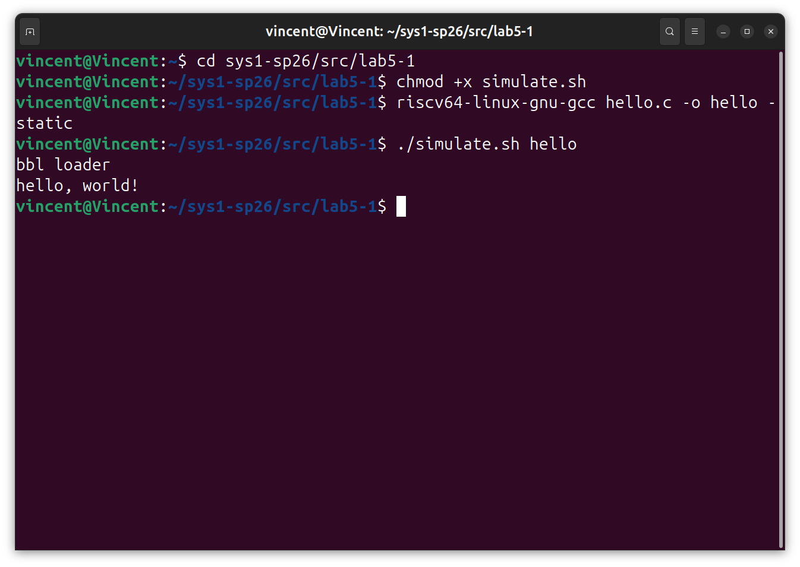
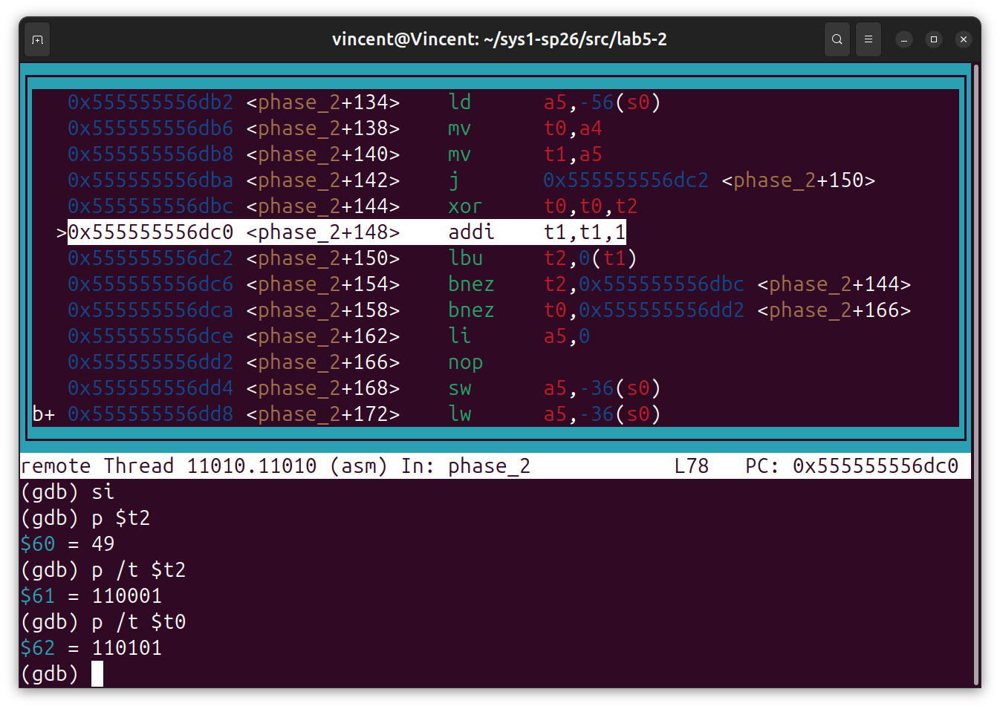
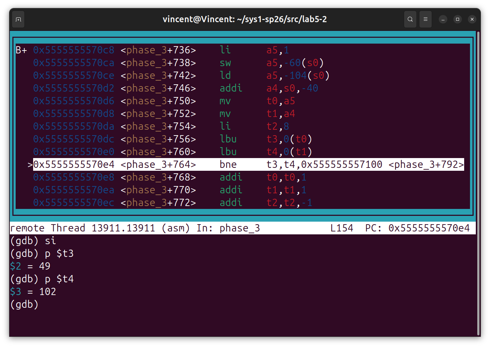
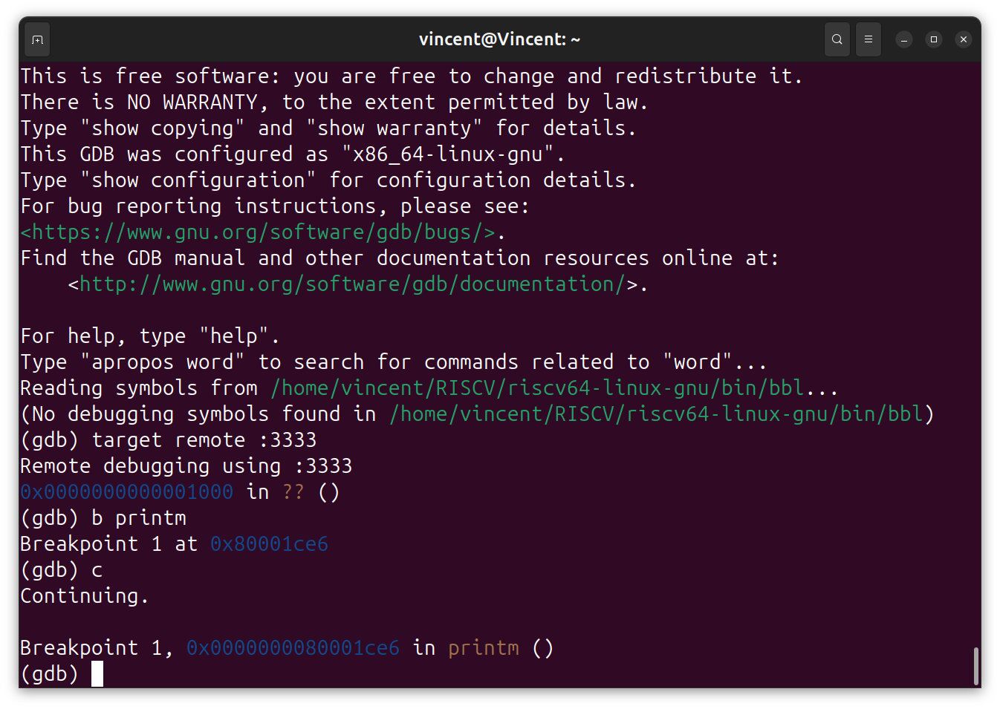
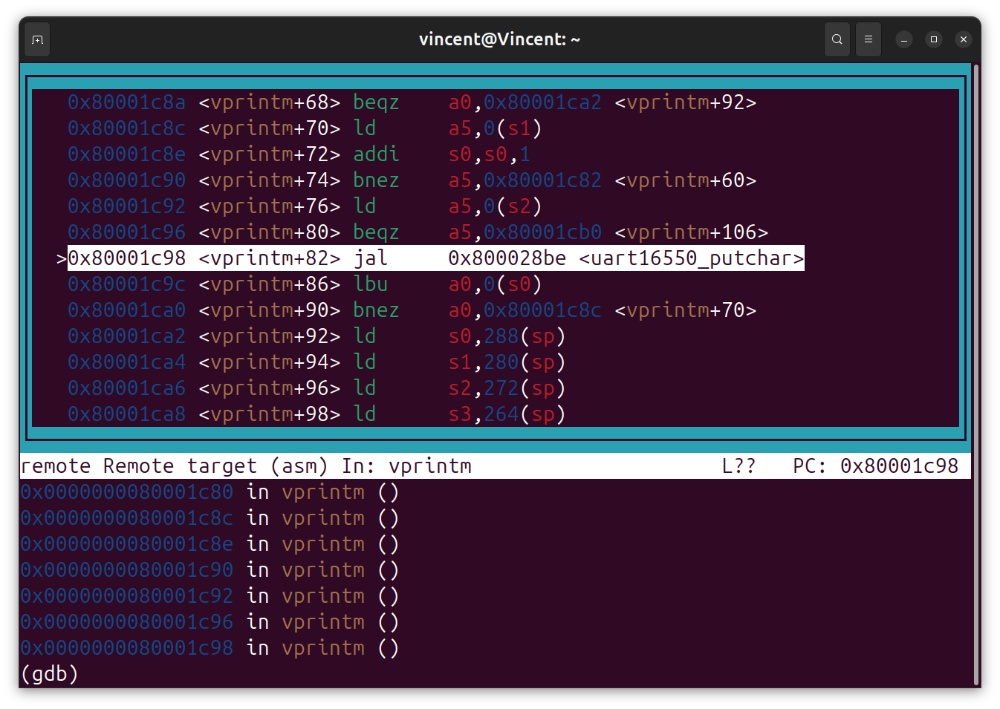
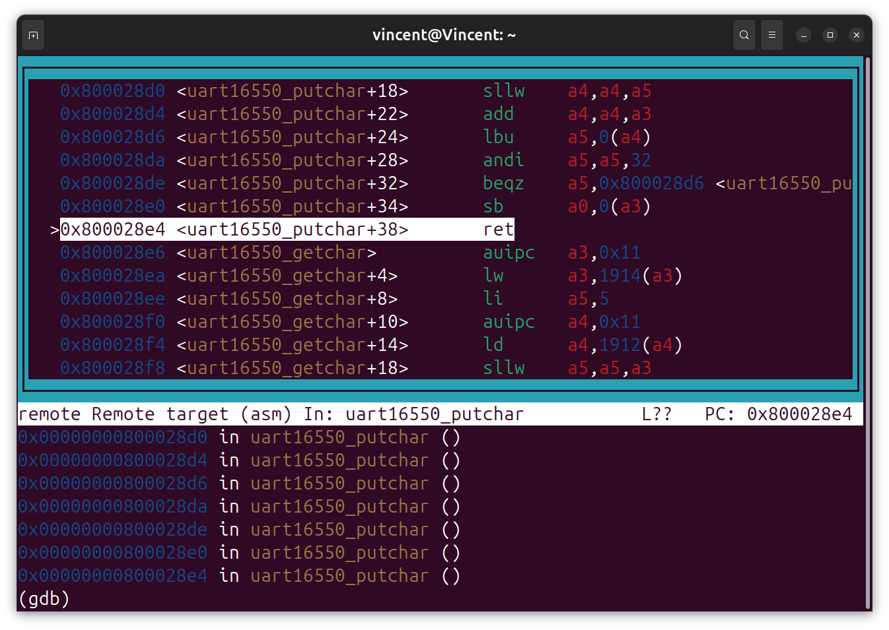

<style>
pre, code {
    page-break-inside: auto !important;
    white-space: pre-wrap !important; 
    word-break: break-all !important;
}

.hljs {
    overflow: visible !important; 
}
</style>

# lab5
___

## lab5-1

### 一、实验环境配置

- **成功截图**：



### 二、理解简单RISC-V程序

#### acc_plain.s解读

1. **acc 是如何获得函数参数的，又是如何返回函数返回值的？**
   - **函数参数**：根据函数调用规范，acc在被调用的时候，参数直接存在了**a寄存器**中，按照顺序，第一个参数**a**，让入**a0**，第二个参数**b**,放入**a1**，acc直接从a0，a1读取数据就行 
   - **返回值**：直接将计算结果放入**a0**即可，父函数直接从**a0**读取就行

2. **acc 函数中 s0 寄存器的作用是什么，为什么在函数入口处需要执行 sd s0, 40(sp) 这条指令，而在这条指令之后的 addi s0, sp, 48 这条指令的目的是什么？** 
   - **s0寄存器作用**：作为**栈指针fp**使用，将s0的值置为栈顶，取用其他数据时，通过**s0**为基准计算偏移量，访问数据
   - **执行 sd s0, 40(sp) 的原因**：s寄存器是**Callee-Saved**，acc调用的时候，需要主动备份保存s0，函数调用结束后，需要恢复s0原来的值
   - **addi s0, sp, 48的目的**：确定**栈指针的位置**,由于**sp**减少了48，开辟了48个字节的栈帧。将**s0**置为**sp + 48**，即当前栈帧的栈顶，此后所有的数据都可以通过这个**s0**确定位置，由于sp可能会改变（可能会有其他调用函数，但本程序没有），所以需要一个指针来保证该栈帧内数据的正确访问  

3. **acc 函数的栈帧 (stack frame) 的大小是多少？**
    - acc的栈帧是**48**字节
    - sp指针往低地址移了48个字节，这个移出去的48个字节，就是acc函数的**栈帧**

4. **acc 函数栈帧中存储的值有哪些，它们分别存储在哪（相对于 sp 或 s0 来说）？**
   - **s0原值**：存储在 **-8(s0)** 或 **40(sp)**
   - **参数a(a0)**：存储在 **-40(s0)** 或 **8(sp)**
   - **参数b(a1)**：存储在 **-48(s0)** 或 **0(sp)**
   - **局部变量sum**：存储在 **-32(s0)** 或 **16(sp)**
   - **局部变量i**：存储在 **-24(s0)** 或 **24(sp)**

5. **请简要解释 acc 函数中的 for 循环是如何在汇编代码中实现的。**
   - **条件跳转**
   1. 先在**L2**进行**条件检查**：先读取当前的**i(a4)**和**b(a5)**,执行`ble a4, a5, .L3`,如果满足循环条件，立刻跳转到**L3**执行循环体
   2. **执行循环体**：在**L3**内部完成**sum**的计算和**i**的自增
   3. 执行完**L3**后无须触发跳转，直接流向**L2**重复**条件检查
   4. 如果发现条件不满足循环条件，**不触发跳转**，自然向下执行，直到退出函数

6. **编译选项 -O0 和 -O2 的区别**：
   1. **-O0**：无编译优化，**所有的局部变量**都存在栈帧里面，严格按照原代码描述写代码，每一次需要用到都需要**从栈帧里面取出来**，**用完后又存回去**
   2. **-O2**：编译优化，**所有的计算**都在**寄存器**中完成，能不用**栈帧**就不使用，大幅减少**ld/sd**的使用

7. **优劣对比**：
   1. **-O0**:
      - **优点**：汇编代码直观，和C语言代码完全一对一对应，便于**调试**，便于**理解**  
      - **缺点**：存在大量的**内存访问和存储的指令**，效率极低，代码冗长
   2. **-O2**：
      - **优点**：运行效率高，**寄存器**代替**内存**，极大的提高了效率代码极端
      - **缺点**：汇编代码结构被**重排**，没有和原代码对应的变量，不方便调试，汇编代码不够直观，和C语言代码逻辑不一样，理解难度增大

### 三、理解递归汇编程序

1. **为什么 src/lab5-1/factor_plain.s 中 factor 函数的入口处需要执行 sd ra, 24(sp) 指令，而 src/lab5-1/acc_plain.s 中的 acc 函数并没有执行该指令？**
   - 在每次调用函数时候，**ra**都会被自动写入当前**调用地址的下一行** 
   - 因为**factor**函数是**非叶子函数**，也就是在factor会调用其他的函数，如果不主动保存ra，在下次调用函数时，**ra**会被下个函数的ra给覆盖掉，无法正确的返回。而acc是**叶子函数**，不会再有其他的函数调用，所以**ra**不会被覆盖，不用保存

2. **请解释在 call factor 前的 mv a0, a5 这条汇编指令的目的**
   - 汇编代码的前两行，把**a5 = n - 1**已经算好，准备传递给子函数计算**factor(n-1)**,但是由于函数调用，参数必须放在**a0**，所以需要在**call factor**之前，把计算好的参数值传递给**a0**

3. **请简要描述调用 factor(10) 时栈的变化情况；并回答栈最大内存占用是多少，发生在什么时候。** 
   1. **栈的变化情况**：调用factor(10)时，会从栈上开辟一个 **32 字节** 的栈帧，用来存 **ra**，**s0** 和参数 **10**
   2. 而在执行到call factor(9)后，又会开辟**32 字节**的栈帧，直到factor(0)，触发边界条件，开始从底层ret
   3. 最大内存占用：在factor(0)返回之前：**32 * 11 = 352 字节**

4. **假设栈的大小为 4KB，请问 factor(n) 的参数 n 最大是多少？**
   参数n最大为**126**
   - 栈空间$4KB = 4096字节$ 
   - 能容纳栈帧为$\frac{4096}{32} = 128个栈帧$
   - main函数需要一个栈帧，factor函数从n到0，共需要**n + 1**个栈帧 $$(n + 1) + 1 \le 128$$
   - 算得n最大为126

5. **请简要描述 src/lab5-1/factor_opt.s 和 src/lab5-1/factor_plain.s 的区别**
   1. **factor_opt.s**完全没有使用栈帧，全程只使用了**a5，a4，a0**，没有大量的**ld/sd**指令
   2. **factor_opt.s**没有在递归调用函数，**把递归版本改成了迭代版本**

6. **请从栈内存占用的角度比较 src/lab5-1/factor_opt.s 和 src/lab5-1/factor_plain.s 的优劣**
   - **factor_opt.s**版本**没有使用栈内存**，无**从栈读写数据的指令**，**效率更高**，**没有栈溢出的风险**，比**factor_plain.s**版本更好

7. **请查阅尾递归优化的相关资料，解释编译器在生成 src/lab5-1/factor_opt.s 时做了什么优化，该优化的原理，以及什么时候能进行该优化。**
   - 把**call factor**换成普通的**循环**，函数的入口，出口所有关于栈帧的**初始化**和**复原**都取消
   - **优化原理**： 如果一个递归函数，它的递归调用拿到子函数的返回值后，当前函数不需要做额外计算，直接返回这个值，就是**尾递归**，如果是尾递归，那么在递归返回时，栈帧存的数据没有如何用处，所以递归优化，就把递归换成**循环**，不去考虑栈帧，直接修改寄存器的值，然后通过条件跳转，回到开头重复过程
   - **优化条件**：递归必须是**尾递归**，或者像**factor_plain.s**这种可以转换成尾递归的算法可以进行**尾递归优化**

### 四、理解 switch 语句产生的跳转表

1. **请简述在 src/lab5-1/switch.s 中是如何实现 switch 语句的。** 
   1. 初始化以及条件判断：计算**a5-20**并与**a4=6**比较，如果大于，说明**x $\le$ 20或者 $\le$ 26**,也就是不用进入switch分支，直接跳转到**L8**返回
   2. **查表确定进入哪个分支**：首先将 **.L4** 加载到 **a4**作为基准，通过计算**a5**确定会进入哪个分支，即确定是进入**跳转表**的哪一项（a5需要乘4获得正确偏移量）并通过表加载出**对应状态和L4**的相对差值
   3. 最后通过a4（跳转基准值），a5（对应状态和L4的相对差值）得到最终跳转的地址，进入对应的分支**顺序执行**，直到遇到ret返回

2. **用跳转表实现 switch 和用 if-else 实现 switch 的优劣，及各自的适用场景。**
   1. **跳转表**：**优点**：**执行效率高**，只需要一次性计算出跳转位置，进入对应分支即可，时间复杂度为**O(1)**，效率高；**缺点**：**内存占用大**，需要额外空间来存表
   2. **if-else**：**优点**：**内存占用小**；**缺点**：必须每个分支判读一次，时间复杂度达到**O(n)**
   3. **跳转表适用场景**：**case**分支非常多，且case分支数值连续且集中
   4. **if-else适用场景**：**case**数量少，case数值非常稀疏，这时候用跳转表会有大量的default空洞，所以用if-else更合适

### 五、设计冒泡排序的汇编代码

```
.text
.globl  bubble_sort

bubble_sort:
    addi a1, a1, -1 
    #a1(len)作为判断有没有结束循环的依据，长度为n，需要n-1次比较，初始化a1--，当a1 = 0时，完成排序

.Out_loop:
    li t3, 0            # t3为内层循环的计数器，初始化为0
    addi t4, a0, 0      # t4指针初始化复位到数组首地址
    beqz a1, .exit      # 如果剩余需要比较的次数为0说明排序完成

.Inner_loop:
    ld t1, 0(t4)                    # 从内存中取出当前元素t1
    ld t2, 8(t4)                    # 从内存中取出当前元素t2，t2和t1的地址相对间隔为8
    ble t1, t2, .skip_exchange      # 如果A <= B，无须交换，直接跳过交换代码
    sd t2, 0(t4)                    # 交换在内存中的值
    sd t1, 8(t4)

.skip_exchange:
    addi t4, t4, 8                  # 指针向后移动8字节（一个long long元素长度）
    addi t3, t3, 1                  # 计数器递增
    blt t3, a1, .Inner_loop         # 当t3 < a1说明比较次数没达到a1，跳转内部循环继续比较

    addi a1, a1, -1                 # 当t3 = a1，本轮内层循环结束，让下一轮需要比较次数减一
    j .Out_loop                     # 跳转回外部循环，判断是否要继续进行内部循环

.exit:
    jr ra                           # 结束函数，回到主函数
```

### 六、设计斐波那契数列的汇编代码

```
.text
.globl  fibonacci

fibonacci:
    addi    sp, sp, -32     #函数序言，开辟32个字节的栈帧
    sd      ra, 24(sp)      #把返回地址ra存入栈中，避免子函数调用的时候被覆盖
    sd      s0, 16(sp)      #备份保存寄存器s0，保证回归父函数的时候将其复原      
    addi    s0, sp, 32      #让s0指向栈顶，作为fp使用
    sd      a0, -24(s0)     #存参数入栈

    ld      a1, -24(s0)             #从栈中读取本层参数
    li      a5, 1                   #确定递归边界，当n=1时停止递归
    bgt     a1, a5, .first_call     #将本层参数a1和边界比较，确定是进入递归还是开始返回
    li      a0, 1                   #如果不用递归，也就是base case（n=1/0）则函数值是1，存入a0准备返回
    j       .exit                   #切换到返回部分

.first_call: 
    addi    a1, a1, -1              #计算下层函数的参数 n-1 
    mv      a0,  a1                 #子函数参数只能放在a0，将参数复制到a0，准备递归
    call    fibonacci               #调用自己，计算fibonacci(n-1)

    mv      a3, a0                  #子函数计算结束，从a0获得子函数的取值，存入a3
    sd      a3, -32(s0)             #将a3存入栈中保存，避免后续调用时a3被覆盖
    
    ld      a1, -24(s0)             #重新获取本层参数，准备计算fibonacci(n-2)参数
    addi    a2, a1, -2              #计算下层函数的参数 n-2
    mv      a0, a2                  #将参数复制到a0，准备递归
    call    fibonacci               #调用自己，计算fibonacci(n-2)

    mv      a4, a0                  #将f(n-2)的值保存在a4，准备计算本层的结果a3+a4
    ld      a3, -32(s0)             #由于中间有函数调用，a3的值不再可信，需要从栈帧中取出之前计算结果

    add     a5, a3, a4              #计算最终结果
    mv      a0, a5                  #按照约定将最终结果存入a0，准备返回

.exit:
    ld      ra, 24(sp)              #获取真正的返回地址
    ld      s0, 16(sp)              #恢复s0
    addi    sp, sp, 32              #恢复栈帧
    jr      ra                      #返回父函数
```

## lab5-2

### 一、尝试通过调试破解数据

#### 1.1 phase_1——0

```
(gdb) b phase_1
Breakpoint 2 at 0x555555556c52: file challenge.c, line 59.
(gdb) c
Continuing.

Breakpoint 2, phase_1 (str=0x555555559050 <input_buffer> "1") at challenge.c:59
```
1. 第一个字符先输1，停止在函数phase_1的入口，接下来，检查phase_1的原码来确定比较逻辑

```
(gdb) list phase_1
52	    }
53	    close(fd);
54	    return h;
55	}
56	
57	int phase_1(const char* str){
58	    
59	    int data = char2num(name_buffer[6]);
60	    int iter = 20;
61	    while(iter--){
(gdb) list phase_1, 100
57	int phase_1(const char* str){
58	    
59	    int data = char2num(name_buffer[6]);
60	    int iter = 20;
61	    while(iter--){
62	        data = (phase_box[data]^phase_box[(data+3)&0xf]^
                           phase_box[phase_box[data]])&0xf;
63	    }
64	    int ret = 1;
65	    while(*str){
66	        if(char2num(*str) == data){
67	            ret = 0;
68	            break;
69	        }
70	        str++;
71	    }
72	    return ret;
73	}
```
2. 确定比较逻辑，经过计算后将**data**和**str**比较，如果相同就通过，在比较的时候设置断点，检查**data**的最终值，即可确定所需要输入的字符串值

```
(gdb) b 64
Breakpoint 3 at 0x555555556cde: file challenge.c, line 64.
(gdb) c
Continuing.

Breakpoint 3, phase_1 (str=0x555555559050 <input_buffer> "1") at challenge.c:64
64	    int ret = 1;
(gdb) p data
$5 = 0
(gdb) 
```
3. 确定最终计算结果**data值为0**，检验

```
please input your student ID:3250105724 
Welcome to my fiendish little bomb. You have 3 phases with
0
Phase 1 defused. How about the next one?
```
4. 检验通过，**phase_1的值为0**

#### 1.2 phase_2——1234/15

1. 随便输入1234，开始测试

```
(gdb) list phase_2, 100
75	int phase_2(const char* str){
76	    int sum = char2num(name_buffer[6])^char2num(name_buffer[7])^char2num(name_buffer[8])^char2num(name_buffer[9]);
77	    int ret = 1;
78	    asm volatile(
79	        "mv t0, %[sum]\n"
80	        "mv t1, %[str]\n"
81	        "j phase_2_L1\n"
82	        "phase_2_L2:\n"
83	        "xor t0, t0, t2\n"
84	        "addi t1, t1, 1\n"
85	        "phase_2_L1:\n"
86	        "lbu t2, 0(t1)\n"
87	        "bne t2, zero, phase_2_L2\n"
88	        "bne t0, zero, phase_2_L3\n"
89	        "mv %[ret], zero\n"
90	        "phase_2_L3:\n"
91	        "nop\n"
92	        :[ret] "=r" (ret)
93	        :[sum] "r" (sum),[str] "r" (str)
94	        :"memory","t0","t1","t2"
95	    );
96	    return ret;
```
2. **确定phase_2的逻辑**：根据汇编代码，首先将**sum**的值存入**t0**和，将**str**指针值存入**t1**，然后进入循环，每次从**str字符串数组**读取一个数存入**t2**，然后将二进制的**t0**和**t2**取异或，**t1**自增，使得**t2**读取下一个元素。直到**t2**读到空元素，即输入的数被处理完了后进行判断，如果这时候**t0 = 0**就将ret设置成**0**（即为字符串通过）

```
(gdb) b 79
Breakpoint 16 at 0x555555556dd8: file challenge.c, line 96.
(gdb) c
Continuing.

(gdb) p sum
$58 = 4
(gdb) p /t sum
$59 = 100

```
3. 确定**sum**的值为**4**，二进制编码为**00000100**，接下来确定**异或逻辑**，确定**t2**读取的数是**ASCII码**，还是十进制数，进入`layout asm`状态，挨个执行汇编代码直到`xor t0, t0, t2`
 


4. 从输出确定，**t2**从**str字符串数组**中读取的是数字对应的**ASCII码**，第一个字符是 **1**，**t2**读取**49**；确定**t2**的位数为八位，**异或逻辑**为八位的异或

5. 由此可以确定，第一个数字取1的话，t0被置为**110101**，第二个数字只需要取**ASCII码的二进制编码为110101**的数字就可以也就是**5**，所以字符串**15**是合理解（此处随机输入的1234也是正确答案）

```
please input your student ID:3250105724
Welcome to my fiendish little bomb. You have 3 phases with
0
Phase 1 defused. How about the next one?
15
Phase 2 defused. How about the next one?
```
6. 验证通过，**15**是合法字符串

#### 1.3 phase_3——f8227086

1. 同样的，先随机输入**1111**,查看函数逻辑
   
```
Breakpoint 17, phase_3 (str=0x555555559050 <input_buffer> "1111")
    at challenge.c:99
99	int phase_3(const char* str){
(gdb) list phase_3, 200
99	int phase_3(const char* str){
100	    if(strlen(str) != 8){
101	        return 1;
102	    }
103	    for(int i=0;i<8;i++){
104	        if(char2num(str[i]) < 0){
105	            return 1;
106	        }
107	    }
108	
109	    int d0 = char2num(name_buffer[6]);
110	    int d1 = char2num(name_buffer[7]);
111	    int d2 = char2num(name_buffer[8]);
112	    int d3 = char2num(name_buffer[9]);
113	    uint32_t seed = ((uint32_t)d0<<12) | ((uint32_t)d1<<8) | ((uint32_t)d2<<4) | (uint32_t)d3;
114	    seed ^= 0x13579bdfu;
115	    uint32_t bin_key = binary_hash_key();
116	    seed ^= bin_key;
117	    seed ^= (bin_key << 11) | (bin_key >> 21);
118	    for(int i=0;i<16;i++){
119	        seed = (seed<<3) | (seed>>29);
120	        seed ^= 0x9e3779b9u + (uint32_t)i * 0x11111111u;
121	        seed ^= (uint32_t)phase_box[(seed>>((uint32_t)i&15u))&15u];
122	    }
123	
124	    const uint8_t enc[8] = {0x5, 0xc, 0x9, 0x1, 0x6, 0xb, 0xe, 0x2};
125	    char expect[9];
126	    for(int i=0;i<8;i++){
127	        uint32_t x = seed ^ (0x45d9f3bu * (uint32_t)(i+1));
128	        asm volatile(
129	            "addi t3, zero, 13\n"
130	            "xor %[x], %[x], t3\n"
131	            "slli t0, %[x], 7\n"
132	            "srli t1, %[x], 3\n"
133	            "xor %[x], t0, t1\n"
134	            "andi %[x], %[x], 15\n"
135	            :[x] "+r" (x)
136	            :
137	            :"t0","t1","t3"
138	        );
139	        int nib = (enc[i] ^ (int)(x & 0xf) ^ phase_box[(seed>>((uint32_t)(i*4)&15u))&15u]) & 0xf;
140	        expect[i] = "0123456789abcdef"[nib];
141	        asm volatile(
142	            "slli t0, %[s], 5\n"
143	            "srli t1, %[s], 2\n"
144	            "xor %[s], t0, t1\n"
145	            "addi %[s], %[s], 61\n"
146	            :[s] "+r" (seed)
147	            :
148	            :"t0","t1"
149	        );
150	    }
151	    expect[8] = '\0';
152	
153	    int ret = 1;
154	    asm volatile(
155	        "mv t0, %[in]\n"
156	        "mv t1, %[ex]\n"
157	        "addi t2, zero, 8\n"
158	        "1:\n"
159	        "lbu t3, 0(t0)\n"
160	        "lbu t4, 0(t1)\n"
161	        "bne t3, t4, 2f\n"
162	        "addi t0, t0, 1\n"
163	        "addi t1, t1, 1\n"
164	        "addi t2, t2, -1\n"
165	        "bne t2, zero, 1b\n"
166	        "lbu t3, 0(t0)\n"
167	        "bne t3, zero, 2f\n"
168	        "mv %[ret], zero\n"
169	        "j 3f\n"
170	        "2:\n"
171	        "addi %[ret], zero, 1\n"
172	        "3:\n"
173	        "nop\n"
174	        :[ret] "=r" (ret)
175	        :[in] "r" (str),[ex] "r" (expect)
176	        :"memory","t0","t1","t2","t3","t4"
177	    );
178	    return ret;
179	} 
180	
```

2. 很明显，合法字符串的长度需要为8，重新输入**11111111**进行测试,根据上一轮获取的代码逻辑，发现有一个字符串数组**expect**比较重要，截止到**151行**，都是计算**expect**的算法且**expect**的取值仅仅和**输入的学号**相关，后续就是比较输入字符串是否合法的程序，推测**expect字符串**为判断字符串是否合法的依据，在**153行**设置断点，读取**expect字符串的值**

```
(gdb) c
Continuing.

(gdb) x/s expect
0x2aaaab2aab08:	"f8227086"
```

3. 读取到**expect字符串**的取值为**f8227086**，进入`layout asm`界面，确定判定逻辑



4. 如截图如上，首先定位到`"bne t3, t4, 2f\n"`该行，读取**t3**和**t4**的取值分别为**1**，**f**借此确定**t0**对应的**in**就是输入的字符串，**t1**对应的字符串**expect**，由后续的判定逻辑轻易得出，该比较函数，就是依次比较输入字符串和**expect**该位元素，全部一致则判定通过（且输入字符串必须是8位，第9位是0，但是这个无须考虑，函数开头就已经限定了字符串长度为8）

5. 验证输入字符串**f8227086**是否正确

```
please input your student ID:3250105724
Welcome to my fiendish little bomb. You have 3 phases with
0
Phase 1 defused. How about the next one?
15
Phase 2 defused. How about the next one?
f8227086
Phase 3 defused.
```

6. 验证通过，三个字符串全部解出


### 二、调试串口工作函数



1. 设置断点，进入**printm**函数，通过layout asm模式,不断逐个执行**si**指令，直到找到**spike**输出字符时汇编代码



2. 找到串口输出相关函数**uart_16550_putchar**



3. 确定当**spike**界面输出**b**时，定位到该汇编代码，即`0x800028e4 <uart_16550_putchar+38> sb a0,0(a3)`

4. spike最后输出为
```
Listening for remote bitbang connection on port 9824.
bbl loader
hart_filter_mask saw unknown hart type: status="okay", mmu_type="riscv,sv57"
```

### 三、uart_16550_putchar原码

```
void uart16550_putchar(uint8_t ch)
{
    while ((uart16550[UART_REG_LSR << uart16550_reg_shift] & 
                                    UART_REG_STATUS_TX) == 0);
    uart16550[UART_REG_QUEUE << uart16550_reg_shift] = ch;
}
```

- 要求状态寄存器空闲后，向指定地址写入一个数据，spike就能得到这个信息，在终端输出