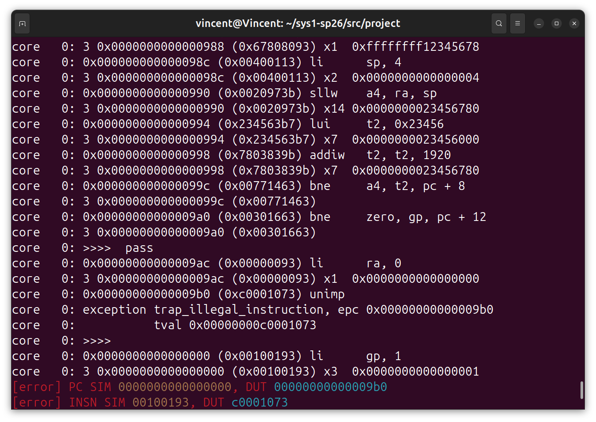
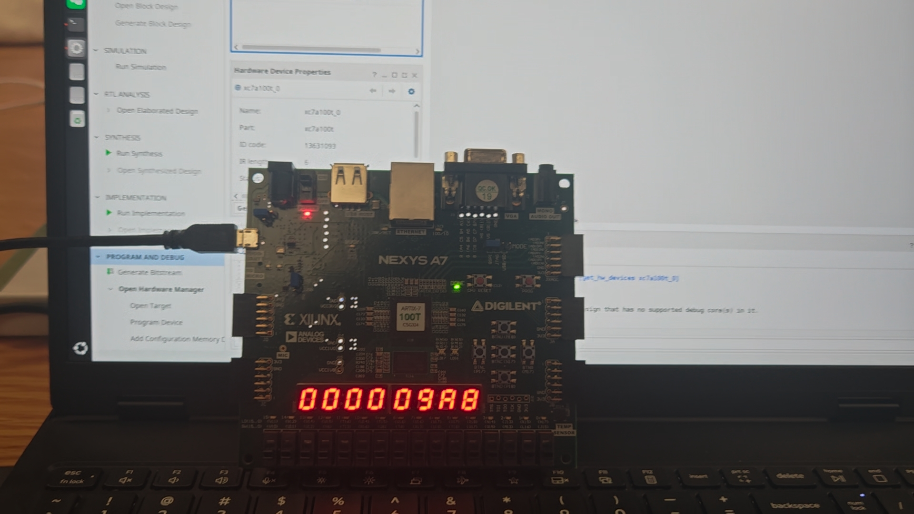

<style>
pre, code {
    page-break-inside: auto !important;
    white-space: pre-wrap !important; 
    word-break: break-all !important;
}

.hljs {
    overflow: visible !important; 
}
</style>

# project

## 一、功能模块设计

### 1.1 RegFile

- **原始代码**：
```Verilog
`include "core_struct.vh"
module RegFile (
  input clk,
  input rst,
  input we,
  input CorePack::reg_ind_t  read_addr_1,
  input CorePack::reg_ind_t  read_addr_2,
  input CorePack::reg_ind_t  write_addr,
  input  CorePack::data_t write_data,
  output CorePack::data_t read_data_1,
  output CorePack::data_t read_data_2
);
  import CorePack::*;

  integer i;
  data_t register [1:31]; // x1 - x31, x0 keeps zero

  // fill your code
  always @(posedge clk) begin
    if (rst) begin
      for (integer i = 1; i < 32; i++) begin
        register[i] <= '0;
      end
    end else if (we && write_addr != 0) begin
      register[write_addr] <= write_data; 
    end
  end

  assign read_data_1 = (read_addr_1 != 5'b0) ? register[read_addr_1] : '0;
  assign read_data_2 = (read_addr_2 != 5'b0) ? register[read_addr_2] : '0;

endmodule
```

- **代码解释**：
  1. **组合逻辑**：直接返回指令中**rs1**,**rs2**的位置对应的寄存器的值，具体是不是正确的值，是否需要有**core**模块判断
  2. **时序逻辑**：通过控制信号**we**判断本周期是否需要写入寄存器新的值，接收**Core**传入的值，写入对应的寄存器

### 1.2 ALU

- **原始代码**:
```Verilog
`include "core_struct.vh"
module ALU (
  input  CorePack::data_t a,
  input  CorePack::data_t b,
  input  CorePack::alu_op_enum  alu_op,
  output CorePack::data_t res
);

  import CorePack::*;
  logic [31:0] temp;

  // fill your code
  always_comb begin
    temp = '0;
    case(alu_op)
        ALU_ADD:  res = a + b;
        ALU_SUB:  res = a - b;
        ALU_AND:  res = a & b;  
        ALU_OR:   res = a | b;
        ALU_XOR:  res = a ^ b; 
        ALU_SLT:  res = {63'b0, $signed(a) < $signed(b)};
        ALU_SLTU: res = {63'b0, a < b};
        ALU_SLL:  res = a << b[5:0];
        ALU_SRL:  res = a >> b[5:0];
        ALU_SRA:  res = $signed(a) >>> b[5:0];
        ALU_ADDW: begin
          temp = a[31:0] + b[31:0];
          res = {{32{temp[31]}}, temp[31:0]};
        end
        ALU_SUBW: begin
          temp = a[31:0] - b[31:0];
          res = {{32{temp[31]}}, temp[31:0]};
        end
        ALU_SLLW: begin
          temp = a[31:0] << b[4:0];
          res = {{32{temp[31]}}, temp[31:0]};
        end
        ALU_SRLW: begin
          temp = a[31:0] >> b[4:0];
          res = {{32{temp[31]}}, temp[31:0]};
        end
        ALU_SRAW: begin
          temp = $signed(a[31:0]) >>> b[4:0];
          res = {{32{temp[31]}}, temp[31:0]};
        end
        ALU_DEFAULT:
          res = 64'b0;
    endcase
  end

endmodule
```

- **代码解释**：
  - 根据控制信号**alu_op**确定对传入的数据进行对应的计算，并注意需要符号位拓展

### 1.3 Cmp

- **原始代码**：

```Verilog
`include"core_struct.vh"
module Cmp (
    input CorePack::data_t a,
    input CorePack::data_t b,
    input CorePack::cmp_op_enum cmp_op,
    output logic cmp_res
);

    import CorePack::*;

    always_comb begin
        case (cmp_op)
            CMP_NO:  cmp_res = 0;
            CMP_EQ:  cmp_res = (a == b) ? 1 : 0;
            CMP_NE:  cmp_res = (a != b) ? 1 : 0;
            CMP_LT:  cmp_res = ($signed(a) < $signed(b)) ? 1: 0;
            CMP_GE:  cmp_res = ($signed(a) < $signed(b)) ? 0: 1;
            CMP_LTU: cmp_res = (a < b) ? 1: 0;
            CMP_GEU: cmp_res = (a < b) ? 0: 1;
            CMP7:    cmp_res = 0;
        endcase
    end
    // fill your code
    
endmodule
```

- **代码解释**：
  - 根据控制信号**cmp_op**确定进行的比较类型，由于只有**B-type**用到Cmp模块，所以Cmp比较的值是固定的，即两个寄存器的值

### 1.4 DataPkg

- **原始代码**：
```Verilog
`include "core_struct.vh"

module DataPkg(
    input CorePack::mem_op_enum mem_op,
    input CorePack::data_t reg_data,
    input CorePack::addr_t dmem_waddr,
    output CorePack::data_t dmem_wdata
);

  import CorePack::*;

  // Data package
  // fill your code

  always_comb begin
      case (mem_op)
        MEM_B: begin
          dmem_wdata = 64'b0;
          dmem_wdata[dmem_waddr[2:0]*8 +: 8] = reg_data[7:0];
        end 

        MEM_H: begin
          dmem_wdata = 64'b0;
          dmem_wdata[{dmem_waddr[2:1],1'b0}*8 +: 16] = reg_data[15:0];
        end

        MEM_W: begin
          dmem_wdata = 64'b0;
          dmem_wdata[{dmem_waddr[2],2'b00}*8 +: 32] = reg_data[31:0];
        end

        MEM_D: begin
          dmem_wdata = reg_data;
        end
        
        default: dmem_wdata = 64'b0;
      endcase
  end

endmodule
```

- **代码解释**：
  - **DataPkg**：负责把**64位**的**reg_data**中真正要写入的部分（由控制信号mem_op决定是8-bits,16-bits,32-bits,64-bits）,移动到**64位数据**的正确字节位置，其余位填0

### 1.5 MaskGen

- **原始代码**：
```verilog
`include "core_struct.vh"

module MaskGen(
    input CorePack::mem_op_enum mem_op,
    input CorePack::addr_t dmem_waddr,
    output CorePack::mask_t dmem_wmask
);

  import CorePack::*;

  // Mask generation
  // fill your code
  
  always_comb begin
    case (mem_op)
      MEM_B: dmem_wmask = 8'h01 << dmem_waddr[2:0];
      MEM_H: dmem_wmask = 8'h03 << {dmem_waddr[2:1], 1'b0};
      MEM_W: dmem_wmask = 8'h0f << {dmem_waddr[2], 2'b00};
      MEM_D: begin
        dmem_wmask = '1;
      end
      default: dmem_wmask = 8'h0;
    endcase
  end

endmodule
```

- **代码解释**：
  - **MaskGen**：根据存储宽度和地址偏移生成**8位的掩码**，告诉内存哪些字节有效,由于MEM_H时移位只能是偶数,则主动将**deme_waddr**的某位置0进行计算，**MEM_W**同理，将末两位置0

### 1.6 DataTrunc

- **原始代码**：
```Verilog
`include "core_struct.vh"

module DataTrunc (
    input CorePack::data_t dmem_rdata,
    input CorePack::mem_op_enum mem_op,
    input CorePack::addr_t dmem_raddr,
    output CorePack::data_t read_data
);

  import CorePack::*;

  // Data trunction
  // fill your code

  data_t shifted_data;
  assign shifted_data = dmem_rdata >> (dmem_raddr[2:0] * 8);
  
  always_comb begin
    case (mem_op)
      MEM_B:  read_data = {{56{shifted_data[7]}},  shifted_data[7:0]};
      MEM_H:  read_data = {{48{shifted_data[15]}}, shifted_data[15:0]};
      MEM_W:  read_data = {{32{shifted_data[31]}}, shifted_data[31:0]};
      MEM_D:  read_data = dmem_rdata;
      MEM_UB: read_data = {56'b0,shifted_data[7:0]};
      MEM_UH: read_data = {48'b0,shifted_data[15:0]};
      MEM_UW: read_data = {32'b0,shifted_data[31:0]};
      MEM_NO: read_data = 64'b0;
    endcase
  end

endmodule
```

- **代码解释**：
  - 从内存读回的**64位数据**中截取所需部分，并根据**mem_op**有无符号做符号扩展或零扩展，得到最终的**read_data**

## 二、数据通路设计

### 2.1 IF阶段

**从内存中读取指令**

- **原始代码 (core)**
```verilog
    //IF阶段，读取指令
    addr_t pc,next_pc;
    data_t imem_rdata;
    inst_t inst;
    
    //imem_ift读请求
    assign imem_ift.r_request_valid = 1'b1;
    assign imem_ift.r_request_bits.raddr = pc;
    assign imem_ift.r_reply_ready = 1'b1;
    assign imem_rdata = imem_ift.r_reply_bits.rdata;

    //通过pc读取指令的低/高32位
    assign inst = (pc[2] == 1) ? imem_rdata[63:32] : imem_rdata[31:0];

    //获取控制信号
    controller controlsignal(
        .inst(inst),
        .we_reg(we_reg),
        .we_mem(we_mem),
        .re_mem(re_mem),
        .npc_sel(npc_sel),
        .immgen_op(imm_op),
        .alu_op(alu_op),
        .alu_asel(alu_asel_op),
        .alu_bsel(alu_bsel_op),
        .wb_sel(wb_sel_op),
        .mem_op(mem_op),
        .cmp_op(cmp_op)
    );
```

- **代码解释**：
  1. 从内存获取数据,由于单周期CPU每周期都要读取指令，并可以接收新的指令，所以将**imem_ift.r_request_valid**,**imem_ift.r_reply_ready**两个信号设置恒为1；通过**pc**确定本次读取数据在内存的地址，从内存中读取**64位数据**
  2. 读取的**64位数据**包含两个指令，通过pc的倒数第二位，确定本次读取指令是**高32位**还是**低32位**

### 2.2 ID阶段

**解码读取的指令**

- **原始代码（core）**
    ```Verilog
    //ID阶段，解码
    reg_ind_t rs1,rs2,rd;
    data_t read_data_1,read_data_2;
    data_t imm;
    assign rs1 = inst[19:15];
    assign rs2 = inst[24:20];
    assign rd = inst[11:7];

    //获取控制信号
    controller controlsignal(
        .inst(inst),
        .we_reg(we_reg),
        .we_mem(we_mem),
        .re_mem(re_mem),
        .npc_sel(npc_sel),
        .immgen_op(imm_op),
        .alu_op(alu_op),
        .alu_asel(alu_asel_op),
        .alu_bsel(alu_bsel_op),
        .wb_sel(wb_sel_op),
        .mem_op(mem_op),
        .cmp_op(cmp_op)
    );

    RegFile regfile(
        .clk(clk),
        .rst(rst),
        .we(we_reg),
        .read_addr_1(rs1),
        .read_addr_2(rs2),
        .write_addr(rd),
        .write_data(wb_val),
        .read_data_1(read_data_1),
        .read_data_2(read_data_2)
    );

    always_comb begin
        case(imm_op)    
            I_IMM: imm = {{52{inst[31]}},inst[31:20]};

            S_IMM: imm = {{52{inst[31]}},inst[31:25],inst[11:7]};
            
            B_IMM: imm = {{51{inst[31]}},inst[31],inst[7],inst[30:25],inst[11:8],1'b0};

            U_IMM: imm = {{32{inst[31]}},inst[31:12],12'b0};

            UJ_IMM: imm = {{43{inst[31]}},inst[31],inst[19:12],inst[20],inst[30:21],1'b0};
            
            default: imm = '0;
        endcase
    end
    ``` 

- **代码解释**：
  1. **RegFile**:本模块中只使用了RegFile模块中**组合逻辑**部分，即通过从指令**inst**中解码出的两个寄存器的地址**rs1**，**rs2**，获取两个寄存器的值**read_data_1**,**read_data_2**，如果寄存器的地址为0，则直接将寄存器的值置为0
  2. **Core**：
   1. 将读取的指令传递入**控制模块**进行处理，获取各个控制信号
   2. 通过控制信号，通过**组合逻辑**，根据不同指令类型，构建**立即数**，

### 2.3 exe阶段

**确定传入ALU的参数,进行ALU计算，跳转指令对比，pc更新**：

- **原始代码(Core)**:
```verilog
    //EXE阶段，计算,更新pc
    data_t alu_a,alu_b;
    data_t alu_res;
    alu_op_enum alu_op;
    cmp_op_enum cmp_op;
    logic cmp_res;
    logic npc_sel;
    logic br_taken;

    always_comb begin
        case(alu_asel_op)
            ASEL0: alu_a = '0;

            ASEL_REG: alu_a = read_data_1;

            ASEL_PC: alu_a = pc;

            ASEL3: alu_a = '0;
        endcase
        
        case(alu_bsel_op)
            BSEL0: alu_b = '0;

            BSEL_REG: alu_b = read_data_2;

            BSEL_IMM: alu_b = imm;

            BSEL3: alu_b = '0;
        endcase
    end
    
    ALU alu(
        .a(alu_a),
        .b(alu_b),
        .alu_op(alu_op),
        .res(alu_res)
    );

    Cmp cmp(
        .a(read_data_1),
        .b(read_data_2),
        .cmp_op(cmp_op),
        .cmp_res(cmp_res)
    );
    
    assign br_taken = cmp_res & (inst[6:0] == BRANCH_OPCODE);
    assign next_pc = (npc_sel | br_taken) ? {alu_res[63:1],1'b0} : (pc + 64'd4);
    always @(posedge clk) begin
        if (rst) begin
            pc <= 64'h0;
        end else begin
            pc <= next_pc;
        end
    end
```

- **代码解释**：
  1. **确定传入ALU参数**：通过控制信号**alu_asel_op**,**alu_bsel_op**确定传入ALU的两个参数的值是来源于**寄存器**，**pc**还是**立即数** 
  2. **ALU**：根据控制信号**alu_op**,对传入alu的两个参数进行运算
  3. **Cmp**：用于**B-type**指令，通过控制信号**cmp_op**,对传入读取的两个寄存器的值进行不同判断，并确实是否满足跳转条件
  4. **分支跳转判断**：若指令类型为**j-type**，则**npc_sel**为1；若指令类型为**B-type**且满足**Cmp**跳转判定条件，则**br_taken**为1，
  5. **更新pc**：**时序逻辑**，每周期时钟上沿时更新pc，**默认情况更新为pc+64'd4**，因为**每条指令为32位**，需要将pc加上32以获取下一条指令的地址；**若满足npc_sel或br_taken**则**pc更新为ALU计算结果**

### 2.4 MEM阶段

**完成与内存的读写,完成L-type S-type**

- **原始代码(Core)**
```Verilog
    //MEM阶段，与dmem完成内存读写
    mem_op_enum mem_op;
    data_t reg_data;
    addr_t dmem_raddr;
    data_t dmem_rdata;
    addr_t dmem_waddr;
    data_t dmem_wdata;
    mask_t dmem_wmask;
    data_t read_data;
    logic we_mem;
    logic re_mem;
    assign reg_data = read_data_2;
    assign dmem_raddr = alu_res;
    assign dmem_waddr = alu_res;

    DataPkg datapkg(
        .mem_op(mem_op),
        .reg_data(reg_data),
        .dmem_waddr(dmem_waddr),
        .dmem_wdata(dmem_wdata) 
    );

    MaskGen maskgen(
        .mem_op(mem_op),
        .dmem_waddr(dmem_waddr),
        .dmem_wmask(dmem_wmask)
    );

    DataTrunc datatrunc(
        .dmem_rdata(dmem_rdata),
        .mem_op(mem_op),
        .dmem_raddr(dmem_raddr),
        .read_data(read_data)
    );


    //dmem_ift读操作
    assign dmem_ift.r_request_valid = re_mem;
    assign dmem_ift.r_request_bits.raddr = alu_res;
    assign dmem_ift.r_reply_ready = 1'b1;
    assign dmem_rdata = dmem_ift.r_reply_bits.rdata;

    //dmem_ift写操作
    assign dmem_ift.w_request_valid = we_mem;
    assign dmem_ift.w_request_bits.waddr = alu_res;
    assign dmem_ift.w_request_bits.wdata = dmem_wdata;
    assign dmem_ift.w_request_bits.wmask = dmem_wmask;
    assign dmem_ift.w_reply_ready = 1'b1;
```

- **代码解释——写入内存（S-type）**：
  1. 写入内存的值只可能是**read_data_2**
  2. 写入内存的地址由**ALU**计算得来**alu_res**
  3. **DataPkg**：处理需要写入的数据
  4. **MaskGen**：根据存储宽度和地址偏移生成**8位的掩码**，告诉内存哪些字节有效
  5. **deme_ift**：通过接口与内存交互，写入内容
- **代码解释——读取内存（L-type）**：
  1. 实例化**DataTrunc**模块，获取从内存读取的值
  2. **deme_ift**：通过接口与内存交互，将**ready**信号置为1，随时接收

### 2.5 WB阶段

**将数据写回寄存器**

- **原始代码**：

```verilog
    //WB阶段，把数据写回寄存器
    logic we_reg;
    data_t wb_val;

    always_comb begin
        case(wb_sel_op)
            WB_SEL0:    wb_val = '0;

            WB_SEL_ALU: wb_val = alu_res;

            WB_SEL_MEM: wb_val = read_data;

            WB_SEL_PC:  wb_val = pc + 64'd4;
        endcase
    end
```

- **代码解释**：
  - 根据控制信号**wb_sel_op**确定写入寄存器的值
  - 在**RegFile**模块中使用**时序逻辑**，确保每周期只有一个寄存器被写入值

## 三、控制单元设计

>原始代码过长不便于展示

- **设计思路**：
  1. 参照**二段译码**思路，将一共十一种指令类型，将可以用**十一指令类型区分的控制信号**用或门连接
  2. 对于需要根据**funct3**，**funct7**区分的信号，再放入**always_comb**中进行连接

## 仿真&下板结果展示

- **TESTCASE=full仿真结果**
<div style="display: flex;">
  
</div>

- **下板结果**
